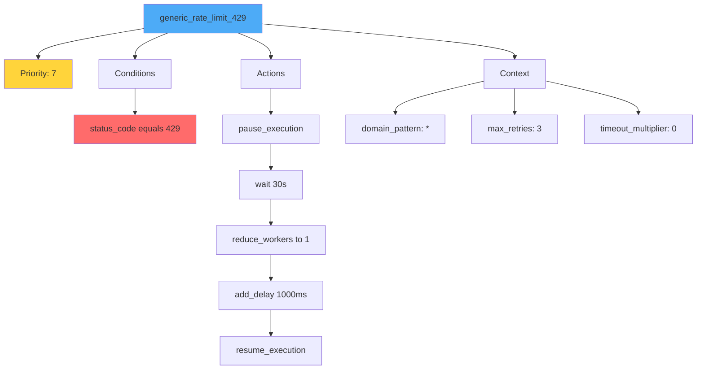
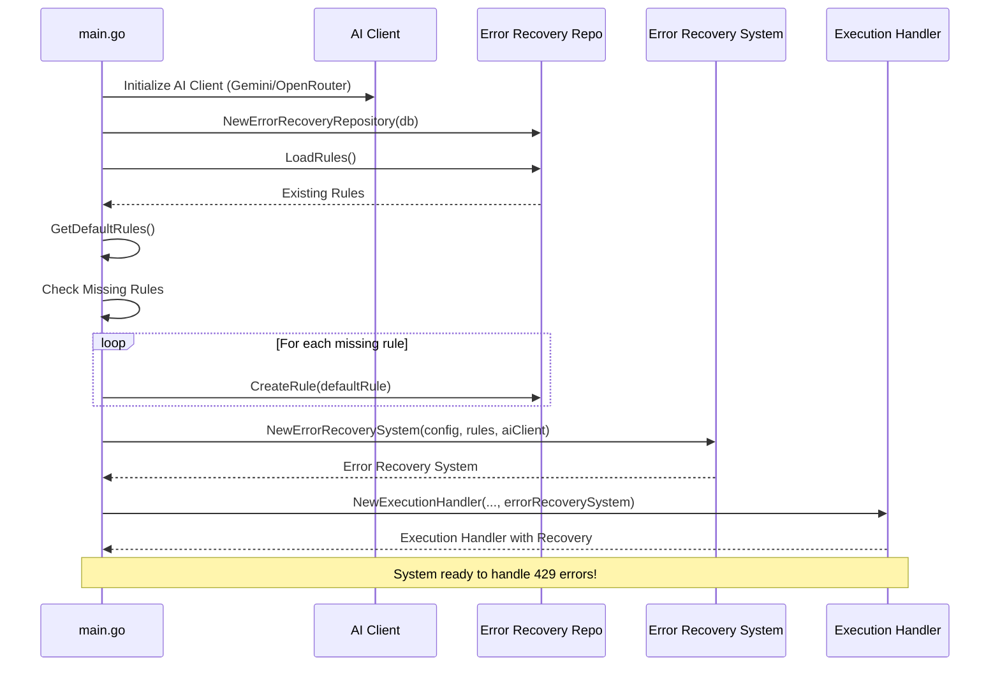
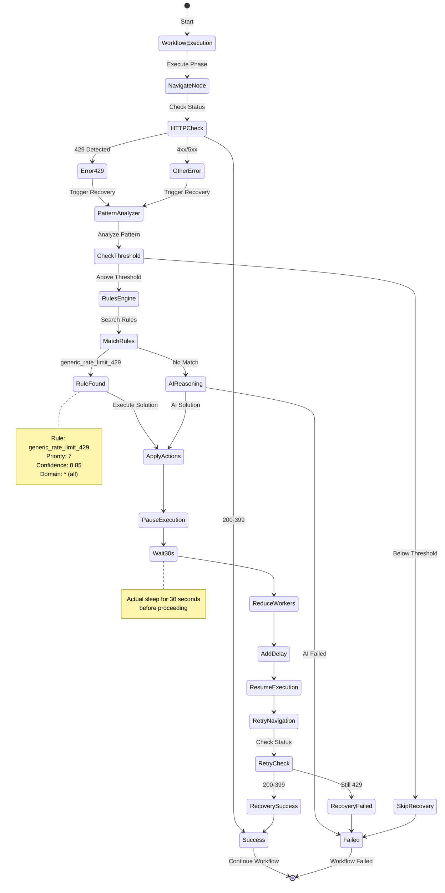

# HTTP 429 Error Recovery System - Complete Implementation

## Overview

This document provides a complete blueprint of the HTTP 429 (Rate Limit) error recovery system implementation in Crawlify. The system automatically detects, analyzes, and recovers from rate limit errors during workflow execution.

## Problem Statement

**Initial Issue:** HTTP 429 errors from navigate nodes were not triggering the error recovery system, causing workflow failures without any retry or recovery attempts.

**Root Causes:**
1. No HTTP status checking after explicit navigate node execution
2. Rule matching failed due to type mismatch (string "429" vs integer 429)
3. Missing generic 429 rule in default rules

## Solution Architecture

```mermaid
graph TB
    Start[Workflow Execution] --> Nav[Navigate Node Executes]
    Nav --> Check{HTTP Status Check}
    Check -->|200-399| Success[Continue Workflow]
    Check -->|429| Detect[⚠️ 429 Detected]
    
    Detect --> Recovery[Error Recovery System]
    Recovery --> Analyze[Pattern Analyzer]
    
    Analyze --> Pattern{Pattern<br/>Detected?}
    Pattern -->|No| Skip[Skip Recovery]
    Pattern -->|Yes| Rules[Rules Engine]
    
    Rules --> Match{Rule<br/>Matched?}
    Match -->|No| AI[AI Reasoning]
    Match -->|Yes| Solution[Apply Solution]
    
    AI -->|Success| Solution
    AI -->|Fail| Fail[Workflow Fails]
    
    Solution --> Actions[Execute Actions]
    Actions --> Pause[⏸️ Pause]
    Pause --> Wait[⏱️ Wait 30s]
    Wait --> Reduce[⬇️ Reduce Workers]
    Reduce --> Delay[⏸️ Add Delay]
    Delay --> Resume[▶️ Resume]
    Resume --> Retry[🔄 Retry Navigate]
    
    Retry --> Recheck{HTTP Status}
    Recheck -->|Success| Success
    Recheck -->|Still 429| Fail
    
    Skip --> Fail
    
    style Detect fill:#ff6b6b
    style Success fill:#51cf66
    style Solution fill:#4dabf7
    style Fail fill:#ff8787
```



## System Components

### 1. HTTP Status Detection

**File:** [internal/browser/http_status.go](file:///home/uzzalh/Workplace/github/uzzalhcse/Crawlify/internal/browser/http_status.go)

**Purpose:** Monitors HTTP responses and detects error status codes.

```mermaid
sequenceDiagram
    participant Nav as Navigate Node
    participant Browser as Browser Context
    participant Check as CheckHTTPStatus
    participant Logger as Logger
    
    Nav->>Browser: Execute Navigation
    Browser->>Browser: Track HTTP Response
    Nav->>Check: CheckHTTPStatus()
    Check->>Check: Inspect Status Code
    
    alt Status >= 400
        Check->>Logger: ⚠️ Log Error Status
        Check->>Nav: Return HTTPError
    else Status < 400
        Check->>Logger: ✅ Log Success
        Check->>Nav: Return nil
    end
```



**Key Code:**
```go
// internal/browser/http_status.go
func (bc *BrowserContext) CheckHTTPStatus() error {
    if bc.lastHTTPStatus >= 400 {
        logger.Warn("⚠️ HTTP error status detected",
            zap.Int("status_code", bc.lastHTTPStatus),
            zap.String("url", bc.lastURL))
        
        if bc.lastHTTPStatus == 429 {
            return fmt.Errorf("rate limit exceeded (HTTP %d)", bc.lastHTTPStatus)
        }
        return fmt.Errorf("HTTP error %d", bc.lastHTTPStatus)
    }
    return nil
}
```

### 2. Navigate Node Error Recovery Integration

**File:** [internal/workflow/executor.go](file:///home/uzzalh/Workplace/github/uzzalhcse/Crawlify/internal/workflow/executor.go) (lines 793-851)

**Purpose:** Integrates HTTP status checking and error recovery into navigate node execution.

```mermaid
flowchart TD
    A[Execute Navigate Node] --> B[executor.Execute]
    B --> C{Execution<br/>Success?}
    C -->|Error| F[Return Error]
    C -->|Success| D[CheckHTTPStatus]
    
    D --> E{HTTP<br/>Error?}
    E -->|No| G[✅ Success]
    E -->|Yes| H[Create ResponseInfo]
    
    H --> I[tryRecoverFromError]
    I --> J{Recovery<br/>Success?}
    
    J -->|No| K[Return Error]
    J -->|Yes| L[Retry Navigation]
    
    L --> M[executor.Execute Again]
    M --> N{Success?}
    N -->|Yes| O[CheckHTTPStatus Again]
    N -->|No| P[Return Error]
    
    O --> Q{HTTP<br/>Error?}
    Q -->|No| R[✅ Retry Success]
    Q -->|Yes| S[HTTP Error Persists]
    
    style G fill:#51cf66
    style R fill:#51cf66
    style F fill:#ff8787
    style K fill:#ff8787
    style P fill:#ff8787
    style S fill:#ff8787
```



**Key Code:**
```go
// internal/workflow/executor.go (after line 795)
if httpErr := e.browserCtx.CheckHTTPStatus(); httpErr != nil {
    logger.Warn("📄 HTTP error detected after navigate node execution",
        zap.String("node_id", nodeID),
        zap.String("url", e.currentURL),
        zap.Error(httpErr))
    
    // Create response info
    responseInfo := &ResponseInfo{
        StatusCode: e.browserCtx.GetLastHTTPStatus(),
        Headers:    make(map[string][]string),
        Body:       "",
    }
    
    // Try error recovery
    if recoveryErr := e.tryRecoverFromError(ctx, httpErr, item, responseInfo); recoveryErr == nil {
        logger.Info("🔄 Retrying navigate node after HTTP error recovery",
            zap.String("node_id", nodeID))
        
        // Retry the navigation
        retryOutput, retryErr := executor.Execute(ctx, e.browserCtx, input)
        if retryErr != nil {
            return nil, fmt.Errorf("navigate retry failed: %w", retryErr)
        }
        
        // Check HTTP status again after retry
        if retryHttpErr := e.browserCtx.CheckHTTPStatus(); retryHttpErr != nil {
            return nil, fmt.Errorf("HTTP error persists after recovery: %w", retryHttpErr)
        }
        
        logger.Info("✅ Navigate node retry successful after HTTP error recovery",
            zap.String("node_id", nodeID))
        return retryOutput, nil
    }
    
    return nil, fmt.Errorf("HTTP error with no recovery available: %w", httpErr)
}
```

### 3. Rule Matching Type Coercion

**File:** [internal/error_recovery/rules.go](file:///home/uzzalh/Workplace/github/uzzalhcse/Crawlify/internal/error_recovery/rules.go) (lines 103-164)

**Problem:** Frontend saves status codes as strings ("429"), but backend compares as integers (429).

**Solution:** Enhanced [evaluateOperator](file:///home/uzzalh/Workplace/github/uzzalhcse/Crawlify/internal/error_recovery/rules.go#102-140) to handle type coercion for the "equals" operator.

```mermaid
flowchart LR
    A[Rule Condition<br/>status_code == 429] --> B{Operator Type}
    B -->|equals| C[Type Check]
    
    C --> D{Both<br/>Same Type?}
    D -->|Yes| E[Direct Compare]
    D -->|No| F[Type Coercion]
    
    F --> G{Expected is<br/>string?}
    G -->|Yes| H[Convert Actual<br/>to String]
    G -->|No| I{Expected is<br/>float64?}
    
    I -->|Yes| J[Convert to Int]
    I -->|No| K[Try String<br/>to Int]
    
    H --> L[String Compare]
    J --> M[Int Compare]
    K --> M
    E --> M
    
    L --> N{Match?}
    M --> N
    N -->|Yes| O[✅ Rule Matched]
    N -->|No| P[❌ No Match]
    
    style O fill:#51cf66
    style P fill:#ff8787
```



**Key Code:**
```go
// internal/error_recovery/rules.go
func (e *ContextAwareRulesEngine) evaluateOperator(operator string, actual interface{}, expected interface{}) bool {
    switch operator {
    case "equals":
        // Handle type coercion for numeric comparisons
        actualInt, actualIsInt := actual.(int)
        
        // Check if expected is a string that should be converted
        if expectedStr, ok := expected.(string); ok {
            if actualIsInt {
                // Try to convert string to int
                if expectedInt, err := strconv.Atoi(expectedStr); err == nil {
                    return actualInt == expectedInt
                }
            }
            // Fall back to string comparison
            return fmt.Sprintf("%v", actual) == expectedStr
        }
        
        // Handle float64 from JSON unmarshaling
        if expectedFloat, ok := expected.(float64); ok && actualIsInt {
            return actualInt == int(expectedFloat)
        }
        
        // Direct comparison
        return actual == expected
        
    // ... other operators
    }
}
```

### 4. Generic 429 Rule

**File:** [internal/error_recovery/default_rules.go](file:///home/uzzalh/Workplace/github/uzzalhcse/Crawlify/internal/error_recovery/default_rules.go) (lines 71-126)

**Purpose:** Provides a catch-all rule for any 429 errors across all domains.



**Key Code:**
```go
{
    ID:          uuid.New().String(),
    Name:        "generic_rate_limit_429",
    Description: "Generic rate limit handler for any domain returning HTTP 429",
    Priority:    7,
    Conditions: []error_recovery.Condition{
        {
            Field:    "status_code",
            Operator: "equals",
            Value:    429,
        },
    },
    Context: error_recovery.RuleContext{
        DomainPattern:     "*",
        Variables:         map[string]interface{}{"backoff_time": 30},
        MaxRetries:        3,
        TimeoutMultiplier: 0,
        LastUpdated:       time.Now(),
    },
    Actions: []error_recovery.Action{
        {Type: "pause_execution", Parameters: map[string]interface{}{}},
        {Type: "wait", Parameters: map[string]interface{}{"duration": 30}},
        {Type: "reduce_workers", Parameters: map[string]interface{}{"count": 1}},
        {Type: "add_delay", Parameters: map[string]interface{}{"duration": 1000}},
        {Type: "resume_execution", Parameters: map[string]interface{}{}},
    },
    Confidence:   0.85,
    SuccessRate:  0.85,
    UsageCount:   0,
    CreatedBy:    "predefined",
}
```

### 5. Error Recovery System Integration

**File:** [cmd/crawler/main.go](file:///home/uzzalh/Workplace/github/uzzalhcse/Crawlify/cmd/crawler/main.go)

**Purpose:** Initializes the error recovery system and passes it to the execution handler.



## Complete Error Recovery Flow



## Files Modified

### Summary of Changes

| File | Lines | Changes | Purpose |
|------|-------|---------|---------|
| [internal/workflow/executor.go](file:///home/uzzalh/Workplace/github/uzzalhcse/Crawlify/internal/workflow/executor.go) | 793-851 | Added HTTP status checking and retry logic | Integrate error recovery into navigate nodes |
| [internal/error_recovery/rules.go](file:///home/uzzalh/Workplace/github/uzzalhcse/Crawlify/internal/error_recovery/rules.go) | 103-164 | Enhanced type coercion in [evaluateOperator](file:///home/uzzalh/Workplace/github/uzzalhcse/Crawlify/internal/error_recovery/rules.go#102-140) | Fix string/int matching for status codes |
| [internal/error_recovery/default_rules.go](file:///home/uzzalh/Workplace/github/uzzalhcse/Crawlify/internal/error_recovery/default_rules.go) | 71-126 | Added `generic_rate_limit_429` rule | Provide default 429 handler |
| [cmd/crawler/main.go](file:///home/uzzalh/Workplace/github/uzzalhcse/Crawlify/cmd/crawler/main.go) | Multiple | Error recovery initialization and integration | Wire up the complete system |

```diff:executor.go
package workflow

import (
	"context"
	"encoding/json"
	"errors"
	"fmt"
	"net/url"
	"regexp"
	"strconv"
	"strings"
	"time"

	"github.com/google/uuid"
	"github.com/uzzalhcse/crawlify/internal/browser"
	"github.com/uzzalhcse/crawlify/internal/extraction"
	"github.com/uzzalhcse/crawlify/internal/logger"
	"github.com/uzzalhcse/crawlify/internal/queue"
	"github.com/uzzalhcse/crawlify/internal/storage"
	"github.com/uzzalhcse/crawlify/internal/workflow/nodes"
	"github.com/uzzalhcse/crawlify/pkg/models"
	"go.uber.org/zap"
)

// ErrURLRequeued is returned when a URL is requeued for later processing
var ErrURLRequeued = errors.New("url requeued for later processing")

type Executor struct {
	browserPool        *browser.BrowserPool
	urlQueue           *queue.URLQueue
	parser             *Parser
	extractedItemsRepo *storage.ExtractedItemsRepository
	nodeExecRepo       *storage.NodeExecutionRepository
	executionRepo      *storage.ExecutionRepository
	registry           *NodeRegistry // NEW: Plugin registry for extensible node execution
	eventBroadcaster   *EventBroadcaster
}

// ExecutionEvent represents a real-time event during workflow execution
type ExecutionEvent struct {
	Type        string                 `json:"type"`
	ExecutionID string                 `json:"execution_id"`
	Timestamp   time.Time              `json:"timestamp"`
	Data        map[string]interface{} `json:"data"`
}

// EventBroadcaster handles distributing events to subscribers
type EventBroadcaster struct {
	subscribers map[chan ExecutionEvent]bool
	register    chan chan ExecutionEvent
	unregister  chan chan ExecutionEvent
	broadcast   chan ExecutionEvent
}

func NewEventBroadcaster() *EventBroadcaster {
	eb := &EventBroadcaster{
		subscribers: make(map[chan ExecutionEvent]bool),
		register:    make(chan chan ExecutionEvent),
		unregister:  make(chan chan ExecutionEvent),
		broadcast:   make(chan ExecutionEvent),
	}
	go eb.run()
	return eb
}

func (eb *EventBroadcaster) run() {
	for {
		select {
		case sub := <-eb.register:
			eb.subscribers[sub] = true
		case sub := <-eb.unregister:
			delete(eb.subscribers, sub)
			close(sub)
		case event := <-eb.broadcast:
			for sub := range eb.subscribers {
				select {
				case sub <- event:
				default:
					// Skip if subscriber is blocked to prevent holding up the broadcaster
				}
			}
		}
	}
}

func (eb *EventBroadcaster) Subscribe() chan ExecutionEvent {
	ch := make(chan ExecutionEvent, 100) // Buffer to prevent blocking
	eb.register <- ch
	return ch
}

func (eb *EventBroadcaster) Unsubscribe(ch chan ExecutionEvent) {
	eb.unregister <- ch
}

func (eb *EventBroadcaster) Publish(event ExecutionEvent) {
	eb.broadcast <- event
}

func NewExecutor(browserPool *browser.BrowserPool, urlQueue *queue.URLQueue, extractedItemsRepo *storage.ExtractedItemsRepository, nodeExecRepo *storage.NodeExecutionRepository, executionRepo *storage.ExecutionRepository) *Executor {
	// Create registry and register default nodes
	registry := NewNodeRegistry()
	if err := registry.RegisterDefaultNodes(); err != nil {
		logger.Error("Failed to register default nodes", zap.Error(err))
	}

	return &Executor{
		browserPool:        browserPool,
		urlQueue:           urlQueue,
		parser:             NewParser(),
		extractedItemsRepo: extractedItemsRepo,
		nodeExecRepo:       nodeExecRepo,
		executionRepo:      executionRepo,
		registry:           registry,
		eventBroadcaster:   NewEventBroadcaster(),
	}
}

// GetEventBroadcaster returns the event broadcaster instance
func (e *Executor) GetEventBroadcaster() *EventBroadcaster {
	return e.eventBroadcaster
}

// GetNodeRegistry returns the node registry instance
func (e *Executor) GetNodeRegistry() *NodeRegistry {
	return e.registry
}

// PublishEvent publishes a new execution event
func (e *Executor) PublishEvent(executionID, eventType string, data map[string]interface{}) {
	if e.eventBroadcaster == nil {
		return
	}

	event := ExecutionEvent{
		Type:        eventType,
		ExecutionID: executionID,
		Timestamp:   time.Now(),
		Data:        data,
	}

	e.eventBroadcaster.Publish(event)
}

// ExecuteWorkflow executes a complete workflow
func (e *Executor) ExecuteWorkflow(ctx context.Context, workflow *models.Workflow, executionID string) error {
	logger.Info("Starting workflow execution",
		zap.String("workflow_id", workflow.ID),
		zap.String("execution_id", executionID),
		zap.Int("start_url_count", len(workflow.Config.StartURLs)),
		zap.Any("start_urls", workflow.Config.StartURLs),
	)

	// Initialize execution stats
	startTime := time.Now()
	stats := models.ExecutionStats{
		URLsDiscovered:  0,
		URLsProcessed:   0,
		URLsFailed:      0,
		ItemsExtracted:  0,
		BytesDownloaded: 0,
		Duration:        0,
		NodesExecuted:   0,
		NodesFailed:     0,
		LastUpdate:      time.Now(),
	}

	// Publish execution started event
	e.PublishEvent(executionID, "execution_started", map[string]interface{}{
		"workflow_id": workflow.ID,
		"start_urls":  len(workflow.Config.StartURLs),
	})

	// Enqueue start URLs
	for _, startURL := range workflow.Config.StartURLs {
		item := &models.URLQueueItem{
			ExecutionID: executionID,
			URL:         startURL,
			Depth:       0,
			Priority:    100,
			URLType:     "start", // Mark as start URL for proper phase detection
		}
		if err := e.urlQueue.Enqueue(ctx, item); err != nil {
			logger.Error("Failed to enqueue start URL", zap.Error(err), zap.String("url", startURL))
		} else {
			stats.URLsDiscovered++
			e.PublishEvent(executionID, "url_discovered", map[string]interface{}{
				"url":  startURL,
				"type": "start",
			})
		}
	}

	// Update stats periodically
	updateTicker := time.NewTicker(5 * time.Second)
	defer updateTicker.Stop()

	// Process URLs from queue
	for {
		select {
		case <-ctx.Done():
			e.PublishEvent(executionID, "execution_failed", map[string]interface{}{
				"error": ctx.Err().Error(),
			})
			return ctx.Err()
		case <-updateTicker.C:
			// Update execution stats
			stats.Duration = time.Since(startTime).Milliseconds()
			stats.LastUpdate = time.Now()

			// Get node execution stats from database
			if e.nodeExecRepo != nil {
				nodeStats, err := e.nodeExecRepo.GetStatsByExecutionID(ctx, executionID)
				if err == nil {
					stats.NodesExecuted = nodeStats["completed"]
					stats.NodesFailed = nodeStats["failed"]
				}
			}

			// Get extracted data count from database
			if e.extractedItemsRepo != nil {
				count, err := e.extractedItemsRepo.GetCount(ctx, executionID)
				if err == nil {
					stats.ItemsExtracted = count
				}
			}

			if e.executionRepo != nil {
				if err := e.executionRepo.UpdateStats(ctx, executionID, stats); err != nil {
					logger.Error("Failed to update execution stats", zap.Error(err))
				}
			}

			// Publish stats update event
			e.PublishEvent(executionID, "stats_updated", map[string]interface{}{
				"stats": stats,
			})

		default:
			// Dequeue next URL
			item, err := e.urlQueue.Dequeue(ctx, executionID)
			if err != nil {
				logger.Error("Failed to dequeue URL", zap.Error(err))
				time.Sleep(1 * time.Second)
				continue
			}

			if item == nil {
				// No more URLs available right now - check if there might be requeued items
				// Wait a bit and check again before declaring completion
				time.Sleep(2 * time.Second)

				// Double-check if there are any pending items
				pendingCount, err := e.urlQueue.GetPendingCount(ctx, executionID)
				if err == nil && pendingCount > 0 {
					// There are still pending items (likely requeued), continue processing
					logger.Debug("Pending URLs found, continuing processing", zap.Int("pending_count", pendingCount))
					continue
				}

				// No more URLs in queue - update final stats
				stats.Duration = time.Since(startTime).Milliseconds()
				stats.LastUpdate = time.Now()

				// Get final node execution stats
				if e.nodeExecRepo != nil {
					nodeStats, err := e.nodeExecRepo.GetStatsByExecutionID(ctx, executionID)
					if err == nil {
						stats.NodesExecuted = nodeStats["completed"]
						stats.NodesFailed = nodeStats["failed"]
					}
				}

				// Get final extracted data count
				if e.extractedItemsRepo != nil {
					count, err := e.extractedItemsRepo.GetCount(ctx, executionID)
					if err == nil {
						stats.ItemsExtracted = count
					}
				}

				if e.executionRepo != nil {
					e.executionRepo.UpdateStats(ctx, executionID, stats)
					e.executionRepo.UpdateStatus(ctx, executionID, models.ExecutionStatusCompleted, "")
				}
				logger.Info("No more URLs to process",
					zap.Int("urls_processed", stats.URLsProcessed),
					zap.Int("items_extracted", stats.ItemsExtracted),
					zap.Int("nodes_executed", stats.NodesExecuted),
				)

				e.PublishEvent(executionID, "execution_completed", map[string]interface{}{
					"stats": stats,
				})
				return nil
			}

			// Process the URL
			if err := e.processURL(ctx, workflow, executionID, item); err != nil {
				// Check if URL was requeued
				if errors.Is(err, ErrURLRequeued) {
					// URL was requeued for later, not a failure
					logger.Debug("URL requeued successfully", zap.String("url", item.URL))
					continue
				}

				logger.Error("Failed to process URL",
					zap.Error(err),
					zap.String("url", item.URL),
				)
				e.urlQueue.MarkFailed(ctx, item.ID, err.Error(), item.RetryCount < 3)
				stats.URLsFailed++
				continue
			}

			// Mark as completed
			if err := e.urlQueue.MarkCompleted(ctx, item.ID); err != nil {
				logger.Error("Failed to mark URL as completed", zap.Error(err))
			}
			stats.URLsProcessed++
		}
	}
}

// processURL processes a single URL using phase-based workflow
func (e *Executor) processURL(ctx context.Context, workflow *models.Workflow, executionID string, item *models.URLQueueItem) error {
	logger.Info("Processing URL",
		zap.String("url", item.URL),
		zap.Int("depth", item.Depth),
		zap.String("phase_id", item.PhaseID))

	// Find the phase to execute for this URL
	var phaseToExecute *models.WorkflowPhase
	for i := range workflow.Config.Phases {
		phase := &workflow.Config.Phases[i]

		// Check if this URL should be processed by this phase
		if e.urlMatchesPhase(item, phase) {
			phaseToExecute = phase
			break
		}
	}

	if phaseToExecute == nil {
		// No matching phase - this might be a start URL, use first phase
		if len(workflow.Config.Phases) > 0 {
			phaseToExecute = &workflow.Config.Phases[0]
			logger.Debug("Using first phase for start URL", zap.String("phase_id", phaseToExecute.ID))
		} else {
			return fmt.Errorf("no phases configured in workflow")
		}
	}

	// Acquire browser context - use profile if specified
	var browserCtx *browser.BrowserContext
	var err error

	if workflow.BrowserProfileID != nil && *workflow.BrowserProfileID != "" {
		logger.Info("Acquiring browser with profile",
			zap.String("profile_id", *workflow.BrowserProfileID),
			zap.String("workflow_id", workflow.ID))
		browserCtx, err = e.browserPool.AcquireWithProfile(ctx, *workflow.BrowserProfileID)
	} else {
		browserCtx, err = e.browserPool.Acquire(ctx)
	}

	if err != nil {
		return fmt.Errorf("failed to acquire browser context: %w", err)
	}
	defer e.browserPool.Release(browserCtx)

	// Set headers and cookies if configured
	if len(workflow.Config.Headers) > 0 {
		browserCtx.SetHeaders(workflow.Config.Headers)
	}

	// BACKWARD COMPATIBILITY: Auto-navigate if no navigate node exists in this phase
	// Check if phase has a navigate node
	hasNavigateNode := false
	for _, node := range phaseToExecute.Nodes {
		if node.Type == models.NodeTypeNavigate {
			hasNavigateNode = true
			break
		}
	}

	// Only auto-navigate if phase doesn't have explicit navigate node
	if !hasNavigateNode {
		logger.Debug("No navigate node found, auto-navigating", zap.String("url", item.URL))
		_, err = browserCtx.Navigate(item.URL)
		if err != nil {
			return fmt.Errorf("failed to navigate to URL: %w", err)
		}
	} else {
		logger.Debug("Navigate node found in phase, skipping auto-navigation")
	}

	// Apply rate limiting
	if workflow.Config.RateLimitDelay > 0 {
		time.Sleep(time.Duration(workflow.Config.RateLimitDelay) * time.Millisecond)
	}

	// Create execution context
	execCtx := models.NewExecutionContext()
	execCtx.Set("_url", item.URL)
	execCtx.Set("_depth", item.Depth)
	execCtx.Set("_phase_id", phaseToExecute.ID)

	// Execute phase nodes
	logger.Info("Executing phase nodes",
		zap.String("phase_id", phaseToExecute.ID),
		zap.String("phase_type", string(phaseToExecute.Type)),
		zap.Int("node_count", len(phaseToExecute.Nodes)))

	e.PublishEvent(executionID, "phase_started", map[string]interface{}{
		"phase_id":   phaseToExecute.ID,
		"phase_name": phaseToExecute.Name,
		"phase_type": phaseToExecute.Type,
		"url":        item.URL,
	})

	if err := e.executeNodeGroup(ctx, phaseToExecute.Nodes, browserCtx, &execCtx, executionID, item); err != nil {
		logger.Error("Phase execution failed",
			zap.String("phase_id", phaseToExecute.ID),
			zap.Error(err))

		e.PublishEvent(executionID, "phase_failed", map[string]interface{}{
			"phase_id": phaseToExecute.ID,
			"error":    err.Error(),
		})
	} else {
		e.PublishEvent(executionID, "phase_completed", map[string]interface{}{
			"phase_id": phaseToExecute.ID,
		})
	}

	// Save extracted data if any was collected (regardless of phase type)
	if e.extractedItemsRepo != nil {
		extractedData := e.collectExtractedData(&execCtx)
		// Debug: Log what was collected
		logger.Debug("Collected extracted data",
			zap.Int("field_count", len(extractedData)),
			zap.Any("data", extractedData))
		if len(extractedData) > 0 {
			schemaName := phaseToExecute.ID
			// Get node execution ID from context (set by the last extraction node)
			var nodeExecIDPtr *string
			if nodeExecID, ok := execCtx.Get("_node_exec_id"); ok {
				if nodeExecIDStr, ok := nodeExecID.(string); ok {
					nodeExecIDPtr = &nodeExecIDStr
				}
			}
			if err := e.saveExtractedData(ctx, executionID, item.ID, schemaName, nodeExecIDPtr, extractedData); err != nil {
				logger.Error("Failed to save extracted data", zap.Error(err))
			} else {
				logger.Info("Saved extracted data",
					zap.String("url", item.URL),
					zap.Int("fields", len(extractedData)))
			}
		}
	}

	// Check for phase transition
	if phaseToExecute.Transition != nil {
		if err := e.handlePhaseTransition(ctx, workflow, phaseToExecute, item, executionID, &execCtx); err != nil {
			logger.Error("Phase transition failed", zap.Error(err))
		}
	}

	return nil
}

// urlMatchesPhase checks if a URL should be processed in a given phase
func (e *Executor) urlMatchesPhase(item *models.URLQueueItem, phase *models.WorkflowPhase) bool {
	logger.Debug("Checking phase match",
		zap.String("url", item.URL),
		zap.String("phase_id", phase.ID),
		zap.String("item_phase_id", item.PhaseID),
		zap.String("item_marker", item.Marker),
		zap.Int("item_depth", item.Depth))

	// If URL has a phase ID assigned, match exactly
	if item.PhaseID != "" {
		matches := item.PhaseID == phase.ID
		logger.Debug("Phase ID match", zap.Bool("matches", matches))
		return matches
	}

	// Otherwise, check URLFilter if present
	if phase.URLFilter == nil {
		logger.Debug("No URL filter for phase",
			zap.String("phase_id", phase.ID),
			zap.Any("phase_config", phase),
		)
		return false
	}

	filter := phase.URLFilter

	// Check markers
	if len(filter.Markers) > 0 {
		logger.Debug("Checking markers",
			zap.Strings("filter_markers", filter.Markers),
			zap.String("item_marker", item.Marker))
		for _, marker := range filter.Markers {
			if item.Marker == marker {
				logger.Debug("Marker matched!", zap.String("marker", marker))
				return true
			}
		}
	}

	// Check depth
	if filter.Depth != nil {
		logger.Debug("Checking depth",
			zap.Int("filter_depth", *filter.Depth),
			zap.Int("item_depth", item.Depth))
		if item.Depth == *filter.Depth {
			logger.Debug("Depth matched!")
			return true
		}
	}

	// Check patterns (regex)
	if len(filter.Patterns) > 0 {
		for _, pattern := range filter.Patterns {
			matched, err := regexp.MatchString(pattern, item.URL)
			if err == nil && matched {
				logger.Debug("Pattern matched!", zap.String("pattern", pattern))
				return true
			}
		}
	}

	logger.Debug("No match for phase", zap.String("phase_id", phase.ID))
	return false
}

// handlePhaseTransition handles transitioning discovered URLs to the next phase
func (e *Executor) handlePhaseTransition(ctx context.Context, workflow *models.Workflow, currentPhase *models.WorkflowPhase, item *models.URLQueueItem, executionID string, execCtx *models.ExecutionContext) error {
	transition := currentPhase.Transition

	// Check transition condition
	shouldTransition := false
	switch transition.Condition {
	case "all_nodes_complete":
		// Always transition after completing all nodes in current URL
		shouldTransition = true
	case "url_count":
		// Check if we've processed enough URLs
		if _, ok := transition.Params["threshold"].(int); ok {
			// This would need tracking - simplified for now
			shouldTransition = true
		}
	default:
		logger.Warn("Unknown transition condition", zap.String("condition", transition.Condition))
	}

	if !shouldTransition {
		return nil
	}

	// If there's a next phase, mark discovered URLs for that phase
	if transition.NextPhase != "" {
		// Get discovered URLs from exec context
		discoveredData, ok := execCtx.Get("_discovered_item_ids")
		if ok {
			if discoveredIDs, ok := discoveredData.([]string); ok && len(discoveredIDs) > 0 {
				// These URLs were discovered in this phase, assign to next phase
				logger.Info("Transitioning URLs to next phase",
					zap.Int("url_count", len(discoveredIDs)),
					zap.String("next_phase", transition.NextPhase))

				for _, id := range discoveredIDs {
					if err := e.urlQueue.UpdatePhaseID(ctx, id, transition.NextPhase); err != nil {
						logger.Error("Failed to update phase ID for transitioned URL",
							zap.String("url_id", id),
							zap.String("phase_id", transition.NextPhase),
							zap.Error(err))
					}
				}
			}
		}
	}

	return nil
}

// updateExecutionStatsForURL updates stats based on URL processing results
func (e *Executor) updateExecutionStatsForURL(ctx context.Context, executionID string, extracted bool, nodesExecuted int, nodesFailed int) {
	// This can be called periodically or after each URL
	// For now, we'll rely on the periodic updates in ExecuteWorkflow
}

// executeNodeGroup executes a group of nodes in DAG order
func (e *Executor) executeNodeGroup(ctx context.Context, nodes []models.Node, browserCtx *browser.BrowserContext, execCtx *models.ExecutionContext, executionID string, item *models.URLQueueItem) error {
	// Build DAG
	dag, err := e.parser.BuildDAG(nodes)
	if err != nil {
		return fmt.Errorf("failed to build DAG: %w", err)
	}

	// Get topologically sorted nodes
	sortedNodes, err := dag.TopologicalSort()
	if err != nil {
		return fmt.Errorf("failed to sort nodes: %w", err)
	}

	// Execute nodes in order
	for _, node := range sortedNodes {
		if err := e.executeNode(ctx, node, browserCtx, execCtx, executionID, item); err != nil {
			if !node.Optional {
				return fmt.Errorf("node '%s' failed: %w", node.ID, err)
			}
			logger.Warn("Optional node failed", zap.String("node_id", node.ID), zap.Error(err))
		}
	}

	return nil
}

// executeNode executes a single node
func (e *Executor) executeNode(ctx context.Context, node *models.Node, browserCtx *browser.BrowserContext, execCtx *models.ExecutionContext, executionID string, item *models.URLQueueItem) error {
	logger.Debug("Executing node", zap.String("node_id", node.ID), zap.String("type", string(node.Type)))

	// Create node execution record FIRST
	var nodeExecID string
	var parentNodeExecIDForEvents *string // Capture parent BEFORE we update context
	if e.nodeExecRepo != nil {
		inputData, _ := json.Marshal(node.Params)

		// Determine parent node execution ID
		// Priority 1: If this is the first node processing a discovered URL, use the discovering node's execution ID from the URL queue
		var parentNodeExecID *string
		if item.ParentNodeExecutionID != nil && *item.ParentNodeExecutionID != "" {
			// Check if there's a node execution record for the discovering node
			parentNodeExecID = item.ParentNodeExecutionID
		} else {
			// Priority 2: Use the last node execution ID from the execution context
			// This is used for sequential node execution within the same phase
			if lastNodeID, ok := execCtx.Get("_last_node_exec_id"); ok {
				if lastNodeIDStr, ok := lastNodeID.(string); ok {
					parentNodeExecID = &lastNodeIDStr
				}
			}
		}

		// Determine node type from node.Type
		nodeType := string(node.Type)
		nodeExec := &models.NodeExecution{
			ExecutionID:           executionID,
			NodeID:                node.ID,
			Status:                models.ExecutionStatusRunning,
			URLID:                 &item.ID, // Link to the URL being processed
			ParentNodeExecutionID: parentNodeExecID,
			NodeType:              &nodeType,
			StartedAt:             time.Now(),
			Input:                 inputData,
			RetryCount:            0,
		}

		if err := e.nodeExecRepo.Create(ctx, nodeExec); err != nil {
			logger.Error("Failed to create node execution record", zap.Error(err))
		} else {
			nodeExecID = nodeExec.ID
			parentNodeExecIDForEvents = nodeExec.ParentNodeExecutionID // Capture for events
			// Store in context for later retrieval (e.g., when saving extracted data)
			execCtx.Set("_node_exec_id", nodeExecID)
			// Track this as the last executed node for sequential tracking
			execCtx.Set("_last_node_exec_id", nodeExecID)
		}
	}

	// NOW publish node_started event with node_execution_id
	e.PublishEvent(executionID, "node_started", map[string]interface{}{
		"node_id":                  node.ID,
		"node_type":                node.Type,
		"node_name":                node.Name,
		"params":                   node.Params,
		"url_id":                   item.ID,
		"node_execution_id":        nodeExecID,
		"parent_node_execution_id": parentNodeExecIDForEvents,
	})

	var result interface{}
	var err error

	// TRY REGISTRY FIRST - New plugin-based execution
	if e.registry != nil && e.registry.IsRegistered(node.Type) {
		logger.Debug("Found node type in registry",
			zap.String("node_type", string(node.Type)),
			zap.String("node_id", node.ID),
		)

		executor, regErr := e.registry.Get(node.Type)
		if regErr == nil {
			// Validate node parameters
			if validErr := executor.Validate(node.Params); validErr != nil {
				err = fmt.Errorf("node validation failed: %w", validErr)
				logger.Error("NodeValidation failed",
					zap.String("node_id", node.ID),
					zap.String("node_type", string(node.Type)),
					zap.Error(err),
				)
			} else {
				logger.Debug("Node validation passed, preparing execution",
					zap.String("node_id", node.ID),
					zap.String("node_type", string(node.Type)),
				)

				// Prepare input for plugin execution
				input := &nodes.ExecutionInput{
					BrowserContext:   browserCtx,
					ExecutionContext: execCtx,
					Params:           node.Params,
					URLItem:          item,
					ExecutionID:      executionID,
				}

				// Execute using plugin
				logger.Debug("Calling executor.Execute",
					zap.String("node_id", node.ID),
					zap.String("node_type", string(node.Type)),
				)

				output, execErr := executor.Execute(ctx, input)
				if execErr != nil {
					err = execErr
					logger.Error("Node execution failed",
						zap.String("node_id", node.ID),
						zap.String("node_type", string(node.Type)),
						zap.Error(err),
					)
				} else {
					result = output.Result
					logger.Debug("Node execution succeeded",
						zap.String("node_id", node.ID),
						zap.String("node_type", string(node.Type)),
						zap.Bool("has_result", result != nil),
						zap.Int("discovered_urls", len(output.DiscoveredURLs)),
					)

					// Handle discovered URLs
					if len(output.DiscoveredURLs) > 0 {
						if enqueuedIDs, enqErr := e.enqueueLinks(ctx, executionID, item, output.DiscoveredURLs, node.Params, node.ID, nodeExecID); enqErr != nil {
							logger.Error("Failed to enqueue links", zap.Error(enqErr))
						} else {
							// Track discovered item IDs in context for phase transition
							if len(enqueuedIDs) > 0 {
								existingIDs, _ := execCtx.Get("_discovered_item_ids")
								var ids []string
								if existingIDs != nil {
									if casted, ok := existingIDs.([]string); ok {
										ids = casted
									}
								}
								ids = append(ids, enqueuedIDs...)
								execCtx.Set("_discovered_item_ids", ids)
							}

							if e.nodeExecRepo != nil && nodeExecID != "" {
								// Update node execution with URLs discovered count
								if nodeExec, getErr := e.nodeExecRepo.GetByID(ctx, nodeExecID); getErr == nil {
									nodeExec.URLsDiscovered = len(output.DiscoveredURLs)
									e.nodeExecRepo.Update(ctx, nodeExec)
								}
							}
						}
					}
				}
			}
		} else {
			logger.Warn("Failed to get executor from registry", zap.String("type", string(node.Type)), zap.Error(regErr))
		}
	} else {
		// Node type not registered in plugin system
		// All built-in node types should be registered via RegisterDefaultNodes()
		err = fmt.Errorf("node type '%s' not registered in plugin system", node.Type)
		logger.Error("Unregistered node type",
			zap.String("type", string(node.Type)),
			zap.String("node_id", node.ID))
	}

	// Store extracted data directly in context (only for non-extraction nodes)
	// Extraction nodes and plugin nodes handle their own context storage
	if node.Type != models.NodeTypeExtract && node.Type != models.NodeTypePlugin {
		if resultMap, ok := result.(map[string]interface{}); ok {
			for k, v := range resultMap {
				execCtx.Set(k, v)
			}
		}
	}

	// Update node execution status
	if e.nodeExecRepo != nil && nodeExecID != "" {
		if err != nil {
			if updateErr := e.nodeExecRepo.MarkFailed(ctx, nodeExecID, err.Error()); updateErr != nil {
				logger.Error("Failed to mark node execution as failed", zap.Error(updateErr))
			}
		} else {
			if updateErr := e.nodeExecRepo.MarkCompleted(ctx, nodeExecID, result); updateErr != nil {
				logger.Error("Failed to mark node execution as completed", zap.Error(updateErr))
			}
		}
	}

	if err != nil && node.Retry.MaxRetries > 0 {
		// Retry logic
		for retry := 0; retry < node.Retry.MaxRetries; retry++ {
			time.Sleep(time.Duration(node.Retry.Delay) * time.Millisecond)
			logger.Info("Retrying node", zap.String("node_id", node.ID), zap.Int("attempt", retry+1))
			// Re-execute the node (simplified - should recursively call executeNode)
			break
		}
	}

	if err != nil {
		e.PublishEvent(executionID, "node_failed", map[string]interface{}{
			"node_id":                  node.ID,
			"node_execution_id":        nodeExecID,
			"parent_node_execution_id": parentNodeExecIDForEvents,
			"error":                    err.Error(),
		})
	} else {
		e.PublishEvent(executionID, "node_completed", map[string]interface{}{
			"node_id":                  node.ID,
			"node_execution_id":        nodeExecID,
			"parent_node_execution_id": parentNodeExecIDForEvents,
			"node_type":                string(node.Type),
			"result":                   result,
		})
	}

	// NOW update the NodeExecution record with completion status
	if e.nodeExecRepo != nil && nodeExecID != "" {
		if err != nil {
			if updateErr := e.nodeExecRepo.MarkFailed(ctx, nodeExecID, err.Error()); updateErr != nil {
				logger.Error("Failed to mark node execution as failed", zap.Error(updateErr))
			}
		} else {
			if updateErr := e.nodeExecRepo.MarkCompleted(ctx, nodeExecID, result); updateErr != nil {
				logger.Error("Failed to mark node execution as completed", zap.Error(updateErr))
			}
		}
	}

	return err
}

// enqueueLinks enqueues discovered links with hierarchy tracking
func (e *Executor) enqueueLinks(ctx context.Context, executionID string, parentItem *models.URLQueueItem, links []string, params map[string]interface{}, nodeID, nodeExecID string) ([]string, error) {
	baseURL, err := url.Parse(parentItem.URL)
	if err != nil {
		return nil, err
	}

	var items []*models.URLQueueItem

	// Get marker from params (for phase-based routing)
	marker := getStringParam(params, "marker")

	// For backward compatibility, also check url_type
	if marker == "" {
		marker = getStringParam(params, "url_type")
	}

	logger.Debug("Enqueuing links with marker",
		zap.String("marker", marker),
		zap.Int("link_count", len(links)),
		zap.String("node_id", nodeID))

	for _, link := range links {
		// Resolve relative URLs
		linkURL, err := url.Parse(link)
		if err != nil {
			continue
		}

		absoluteURL := baseURL.ResolveReference(linkURL).String()

		// Apply URL filters if specified
		if shouldSkipURL(absoluteURL, params) {
			continue
		}

		item := &models.URLQueueItem{
			ExecutionID:           executionID,
			URL:                   absoluteURL,
			Depth:                 parentItem.Depth + 1,
			Priority:              parentItem.Priority - 10,
			ParentURLID:           &parentItem.ID,
			DiscoveredByNode:      &nodeID,
			ParentNodeExecutionID: &nodeExecID, // NEW: Track the node execution that discovered this URL
			URLType:               marker,      // For backward compatibility
			Marker:                marker,      // NEW: Set marker for phase matching
			PhaseID:               "",          // Will be set by phase transition logic
		}

		logger.Debug("Enqueued URL",
			zap.String("url", absoluteURL),
			zap.String("marker", marker),
			zap.Int("depth", parentItem.Depth+1))

		items = append(items, item)
	}

	// Enqueue batch and get IDs
	if err := e.urlQueue.EnqueueBatch(ctx, items); err != nil {
		return nil, err
	}

	// Collect IDs of enqueued items
	var enqueuedIDs []string
	for _, item := range items {
		enqueuedIDs = append(enqueuedIDs, item.ID)
	}

	return enqueuedIDs, nil
}

// Helper functions
func getStringParam(params map[string]interface{}, key string) string {
	if val, ok := params[key].(string); ok {
		return val
	}
	return ""
}

func getIntParam(params map[string]interface{}, key string) int {
	if val, ok := params[key].(float64); ok {
		return int(val)
	}
	if val, ok := params[key].(int); ok {
		return val
	}
	return 0
}

func shouldSkipURL(url string, params map[string]interface{}) bool {
	// Implement URL filtering logic based on params
	// For example: pattern matching, domain filtering, etc.
	return false
}

// matchesPattern checks if URL matches a glob-style pattern
func matchesPattern(url string, pattern string) bool {
	// Simple pattern matching - supports wildcards
	// Pattern examples:
	// - "*/dp/*" matches any URL with /dp/ in it
	// - "https://www.amazon.com/dp/*" matches Amazon product pages
	// - "*product*" matches any URL containing "product"

	// Convert glob pattern to simple matching
	if pattern == "*" {
		return true
	}

	// Check if pattern contains the URL or vice versa
	if len(pattern) > 0 && pattern[0] == '*' && pattern[len(pattern)-1] == '*' {
		// *pattern* - contains
		substr := pattern[1 : len(pattern)-1]
		return len(substr) == 0 || containsString(url, substr)
	} else if len(pattern) > 0 && pattern[0] == '*' {
		// *pattern - ends with
		suffix := pattern[1:]
		return len(url) >= len(suffix) && url[len(url)-len(suffix):] == suffix
	} else if len(pattern) > 0 && pattern[len(pattern)-1] == '*' {
		// pattern* - starts with
		prefix := pattern[:len(pattern)-1]
		return len(url) >= len(prefix) && url[:len(prefix)] == prefix
	}

	// Exact match
	return url == pattern
}

// containsString checks if s contains substr
func containsString(s, substr string) bool {
	return len(s) >= len(substr) &&
		(s == substr ||
			(len(s) > len(substr) && (s[:len(substr)] == substr ||
				containsString(s[1:], substr))))
}

// collectExtractedData collects all extracted data from execution context
// Only data set by extract nodes should be saved - all other node outputs are metadata
func (e *Executor) collectExtractedData(execCtx *models.ExecutionContext) map[string]interface{} {
	data := make(map[string]interface{})

	logger.Debug("Collecting extracted data from execution context",
		zap.Int("context_size", len(execCtx.Data)),
	)

	// Check if this context has any extracted fields marker
	// Extract nodes set a special marker to indicate they have extracted data
	extractedFields, hasExtractedData := execCtx.Get("__extracted_fields__")
	if !hasExtractedData {
		logger.Debug("No extracted fields marker found in context")
		// No extract node was executed, return empty
		return data
	}

	// Get the list of field names that were extracted
	fieldNames, ok := extractedFields.([]string)
	if !ok {
		return data
	}

	// Collect only the fields that were explicitly extracted
	for _, fieldName := range fieldNames {
		if value, exists := execCtx.Get(fieldName); exists {
			data[fieldName] = value
		}
	}

	// Always include the source URL for reference
	if url, exists := execCtx.Get("_url"); exists {
		data["source_url"] = url
	}

	return data
}

// saveExtractedData saves extracted data to storage
func (e *Executor) saveExtractedData(ctx context.Context, executionID, urlID, schemaName string, nodeExecID *string, result interface{}) error {
	// Marshal entire result to JSON
	dataJSON, err := json.Marshal(result)
	if err != nil {
		return fmt.Errorf("failed to marshal extracted data: %w", err)
	}

	item := &models.ExtractedItem{
		ID:              uuid.New().String(),
		ExecutionID:     executionID,
		URLID:           urlID,
		NodeExecutionID: nodeExecID,
		SchemaName:      &schemaName,
		Data:            string(dataJSON),
		ExtractedAt:     time.Now(),
	}

	e.PublishEvent(executionID, "item_extracted", map[string]interface{}{
		"item_id": item.ID,
		"data":    result,
	})

	return e.extractedItemsRepo.Create(ctx, item)
}

// Helper functions for parsing extracted data
func parsePrice(s string) (float64, error) {
	// Remove currency symbols and whitespace
	s = strings.TrimSpace(s)
	s = strings.ReplaceAll(s, "$", "")
	s = strings.ReplaceAll(s, "€", "")
	s = strings.ReplaceAll(s, "£", "")
	s = strings.ReplaceAll(s, "¥", "")
	s = strings.ReplaceAll(s, ",", "")
	s = strings.TrimSpace(s)

	if s == "" {
		return 0, fmt.Errorf("empty price")
	}

	return strconv.ParseFloat(s, 64)
}

func parseRating(s string) (float64, error) {
	// Extract numeric rating from strings like "4.5 out of 5 stars"
	s = strings.TrimSpace(s)

	// Try direct parsing first
	if r, err := strconv.ParseFloat(s, 64); err == nil {
		return r, nil
	}

	// Try to extract first number
	re := regexp.MustCompile(`(\d+\.?\d*)`)
	matches := re.FindStringSubmatch(s)
	if len(matches) > 1 {
		return strconv.ParseFloat(matches[1], 64)
	}

	return 0, fmt.Errorf("could not parse rating")
}

func parseInt(s string) (int, error) {
	// Remove commas and whitespace
	s = strings.TrimSpace(s)
	s = strings.ReplaceAll(s, ",", "")

	// Extract first number
	re := regexp.MustCompile(`(\d+)`)
	matches := re.FindStringSubmatch(s)
	if len(matches) > 1 {
		return strconv.Atoi(matches[1])
	}

	return strconv.Atoi(s)
}

// executePagination handles pagination logic - both click-based and link-based
func (e *Executor) executePagination(ctx context.Context, node *models.Node, browserCtx *browser.BrowserContext, extractionEngine *extraction.ExtractionEngine, executionID string, item *models.URLQueueItem) (interface{}, error) {
	// Pagination parameters
	nextSelector := getStringParam(node.Params, "next_selector")       // Selector for "Next" button/link
	paginationSelector := getStringParam(node.Params, "link_selector") // Selector for pagination links (1,2,3...)
	maxPages := getIntParam(node.Params, "max_pages")                  // Maximum pages to paginate (0 = unlimited)
	paginationType := getStringParam(node.Params, "type")              // "click" or "link" (default: auto-detect)
	waitAfterClick := getIntParam(node.Params, "wait_after")           // Wait time after click/navigation (ms)
	itemSelector := getStringParam(node.Params, "item_selector")       // Items to extract from each page

	// Validate parameters
	if nextSelector == "" && paginationSelector == "" {
		return nil, fmt.Errorf("pagination requires either next_selector or link_selector")
	}

	// Default values
	if maxPages == 0 {
		maxPages = 100 // Default max pages to prevent infinite loops
	}
	if waitAfterClick == 0 {
		waitAfterClick = 2000 // Default 2 seconds wait
	}

	logger.Info("Starting pagination",
		zap.String("url", item.URL),
		zap.String("next_selector", nextSelector),
		zap.String("link_selector", paginationSelector),
		zap.Int("max_pages", maxPages),
		zap.String("type", paginationType))

	var allLinks []string
	currentPage := 1

	// Pagination loop
	for currentPage <= maxPages {
		logger.Debug("Processing pagination page",
			zap.Int("page", currentPage),
			zap.String("url", item.URL))

		// Extract items/links from current page if item_selector is provided
		if itemSelector != "" {
			links, err := extractionEngine.ExtractLinks(itemSelector, 0)
			if err == nil && len(links) > 0 {
				// Resolve relative URLs
				baseURL, _ := url.Parse(item.URL)
				for _, link := range links {
					linkURL, err := url.Parse(link)
					if err == nil {
						absoluteURL := baseURL.ResolveReference(linkURL).String()
						allLinks = append(allLinks, absoluteURL)
					}
				}
				logger.Debug("Extracted items from page",
					zap.Int("page", currentPage),
					zap.Int("items", len(links)))
			}
		}

		// Check if we've reached max pages
		if currentPage >= maxPages {
			logger.Info("Reached max pages limit", zap.Int("max_pages", maxPages))
			break
		}

		// Try to navigate to next page
		navigated := false

		// Strategy 1: Try next button/link (click-based or href-based)
		if nextSelector != "" {
			nextNavigated, err := e.tryNavigateNext(browserCtx, nextSelector, paginationType, waitAfterClick)
			if err != nil {
				logger.Debug("Next navigation failed", zap.Error(err))
			} else if nextNavigated {
				navigated = true
				item.URL = browserCtx.Page.URL() // Update current URL
			}
		}

		// Strategy 2: Try pagination links if next button didn't work
		if !navigated && paginationSelector != "" {
			linkNavigated, err := e.tryNavigatePaginationLink(browserCtx, paginationSelector, currentPage+1, paginationType, waitAfterClick)
			if err != nil {
				logger.Debug("Pagination link navigation failed", zap.Error(err))
			} else if linkNavigated {
				navigated = true
				item.URL = browserCtx.Page.URL() // Update current URL
			}
		}

		// If no navigation succeeded, we've reached the end
		if !navigated {
			logger.Info("No more pages available", zap.Int("pages_processed", currentPage))
			break
		}

		currentPage++
	}

	logger.Info("Pagination completed",
		zap.Int("pages_processed", currentPage),
		zap.Int("total_items", len(allLinks)))

	// Enqueue all discovered links if we have them
	if len(allLinks) > 0 {
		if _, err := e.enqueueLinks(ctx, executionID, item, allLinks, node.Params, node.ID, ""); err != nil {
			logger.Error("Failed to enqueue paginated links", zap.Error(err))
			return nil, err
		}
	}

	return map[string]interface{}{
		"pages_processed": currentPage,
		"items_found":     len(allLinks),
		"links":           allLinks,
	}, nil
}

// tryNavigateNext attempts to navigate using the "next" button/link
func (e *Executor) tryNavigateNext(browserCtx *browser.BrowserContext, nextSelector string, paginationType string, waitAfter int) (bool, error) {
	page := browserCtx.Page

	// Check if next button exists and is visible
	locator := page.Locator(nextSelector)
	count, err := locator.Count()
	if err != nil || count == 0 {
		return false, fmt.Errorf("next element not found")
	}

	// Check if element is disabled or hidden
	isVisible, err := locator.First().IsVisible()
	if err != nil || !isVisible {
		return false, fmt.Errorf("next element not visible")
	}

	// Check if it's disabled (common for pagination)
	isDisabled, err := locator.First().IsDisabled()
	if err == nil && isDisabled {
		return false, fmt.Errorf("next element is disabled")
	}

	// Scroll the element into view before interacting
	err = locator.First().ScrollIntoViewIfNeeded()
	if err != nil {
		logger.Warn("Failed to scroll next button into view", zap.Error(err))
		// Continue anyway - might still work
	}

	// Small delay after scroll to ensure element is ready
	time.Sleep(500 * time.Millisecond)

	// Auto-detect type or use specified type
	if paginationType == "" || paginationType == "auto" {
		// Try to get href attribute
		href, err := locator.First().GetAttribute("href")
		if err == nil && href != "" && href != "#" && href != "javascript:void(0)" {
			paginationType = "link"
		} else {
			paginationType = "click"
		}
	}

	currentURL := page.URL()

	// Navigate based on type
	if paginationType == "link" {
		// Extract href and navigate
		href, err := locator.First().GetAttribute("href")
		if err != nil || href == "" || href == "#" {
			return false, fmt.Errorf("invalid href")
		}

		// Resolve relative URL
		baseURL, _ := url.Parse(currentURL)
		linkURL, err := url.Parse(href)
		if err != nil {
			return false, fmt.Errorf("invalid URL: %w", err)
		}
		absoluteURL := baseURL.ResolveReference(linkURL).String()

		// Navigate to the URL
		_, err = browserCtx.Navigate(absoluteURL)
		if err != nil {
			return false, fmt.Errorf("navigation failed: %w", err)
		}
	} else {
		// Click-based navigation
		err := locator.First().Click()
		if err != nil {
			return false, fmt.Errorf("click failed: %w", err)
		}
	}

	// Wait after navigation
	time.Sleep(time.Duration(waitAfter) * time.Millisecond)

	// Verify URL changed or content loaded
	newURL := page.URL()
	if newURL == currentURL && paginationType == "link" {
		return false, fmt.Errorf("URL did not change after navigation")
	}

	return true, nil
}

// tryNavigatePaginationLink attempts to navigate using pagination number links
func (e *Executor) tryNavigatePaginationLink(browserCtx *browser.BrowserContext, linkSelector string, pageNumber int, paginationType string, waitAfter int) (bool, error) {
	page := browserCtx.Page

	// Find all pagination links
	locator := page.Locator(linkSelector)
	count, err := locator.Count()
	if err != nil || count == 0 {
		return false, fmt.Errorf("pagination links not found")
	}

	// Try to find link with matching page number
	var targetLocator interface{} = nil
	for i := 0; i < count; i++ {
		element := locator.Nth(i)
		text, err := element.InnerText()
		if err == nil {
			text = strings.TrimSpace(text)
			if text == strconv.Itoa(pageNumber) {
				targetLocator = element
				break
			}
		}
	}

	if targetLocator == nil {
		return false, fmt.Errorf("page number %d not found", pageNumber)
	}

	// Scroll the pagination link into view before interacting
	err = targetLocator.(interface{ ScrollIntoViewIfNeeded() error }).ScrollIntoViewIfNeeded()
	if err != nil {
		logger.Warn("Failed to scroll pagination link into view", zap.Error(err))
		// Continue anyway - might still work
	}

	// Small delay after scroll to ensure element is ready
	time.Sleep(500 * time.Millisecond)

	// Navigate using the found link
	currentURL := page.URL()

	if paginationType == "link" || paginationType == "" {
		// Try href first
		href, err := targetLocator.(interface{ GetAttribute(string) (string, error) }).GetAttribute("href")
		if err == nil && href != "" && href != "#" {
			baseURL, _ := url.Parse(currentURL)
			linkURL, err := url.Parse(href)
			if err == nil {
				absoluteURL := baseURL.ResolveReference(linkURL).String()
				_, err = browserCtx.Navigate(absoluteURL)
				if err == nil {
					time.Sleep(time.Duration(waitAfter) * time.Millisecond)
					return true, nil
				}
			}
		}
	}

	// Fall back to click
	err = targetLocator.(interface{ Click() error }).Click()
	if err != nil {
		return false, fmt.Errorf("click failed: %w", err)
	}

	time.Sleep(time.Duration(waitAfter) * time.Millisecond)
	return true, nil
}
===
package workflow

import (
	"context"
	"encoding/json"
	"errors"
	"fmt"
	"net/url"
	"regexp"
	"strconv"
	"strings"
	"time"

	"github.com/google/uuid"
	"github.com/uzzalhcse/crawlify/internal/browser"
	"github.com/uzzalhcse/crawlify/internal/extraction"
	"github.com/uzzalhcse/crawlify/internal/logger"
	"github.com/uzzalhcse/crawlify/internal/queue"
	"github.com/uzzalhcse/crawlify/internal/storage"
	"github.com/uzzalhcse/crawlify/internal/workflow/nodes"
	"github.com/uzzalhcse/crawlify/pkg/models"
	"go.uber.org/zap"
)

// ErrURLRequeued is returned when a URL is requeued for later processing
var ErrURLRequeued = errors.New("url requeued for later processing")

type Executor struct {
	browserPool         *browser.BrowserPool
	urlQueue            *queue.URLQueue
	parser              *Parser
	extractedItemsRepo  *storage.ExtractedItemsRepository
	nodeExecRepo        *storage.NodeExecutionRepository
	executionRepo       *storage.ExecutionRepository
	registry            *NodeRegistry // NEW: Plugin registry for extensible node execution
	eventBroadcaster    *EventBroadcaster
	errorRecoverySystem interface{} // NEW: Error recovery system (using interface{} to avoid circular import)
}

// ExecutionEvent represents a real-time event during workflow execution
type ExecutionEvent struct {
	Type        string                 `json:"type"`
	ExecutionID string                 `json:"execution_id"`
	Timestamp   time.Time              `json:"timestamp"`
	Data        map[string]interface{} `json:"data"`
}

// EventBroadcaster handles distributing events to subscribers
type EventBroadcaster struct {
	subscribers map[chan ExecutionEvent]bool
	register    chan chan ExecutionEvent
	unregister  chan chan ExecutionEvent
	broadcast   chan ExecutionEvent
}

func NewEventBroadcaster() *EventBroadcaster {
	eb := &EventBroadcaster{
		subscribers: make(map[chan ExecutionEvent]bool),
		register:    make(chan chan ExecutionEvent),
		unregister:  make(chan chan ExecutionEvent),
		broadcast:   make(chan ExecutionEvent),
	}
	go eb.run()
	return eb
}

func (eb *EventBroadcaster) run() {
	for {
		select {
		case sub := <-eb.register:
			eb.subscribers[sub] = true
		case sub := <-eb.unregister:
			delete(eb.subscribers, sub)
			close(sub)
		case event := <-eb.broadcast:
			for sub := range eb.subscribers {
				select {
				case sub <- event:
				default:
					// Skip if subscriber is blocked to prevent holding up the broadcaster
				}
			}
		}
	}
}

func (eb *EventBroadcaster) Subscribe() chan ExecutionEvent {
	ch := make(chan ExecutionEvent, 100) // Buffer to prevent blocking
	eb.register <- ch
	return ch
}

func (eb *EventBroadcaster) Unsubscribe(ch chan ExecutionEvent) {
	eb.unregister <- ch
}

func (eb *EventBroadcaster) Publish(event ExecutionEvent) {
	eb.broadcast <- event
}

func NewExecutor(browserPool *browser.BrowserPool, urlQueue *queue.URLQueue, extractedItemsRepo *storage.ExtractedItemsRepository, nodeExecRepo *storage.NodeExecutionRepository, executionRepo *storage.ExecutionRepository, errorRecoverySystem interface{}) *Executor {
	// Create registry and register default nodes
	registry := NewNodeRegistry()
	if err := registry.RegisterDefaultNodes(); err != nil {
		logger.Error("Failed to register default nodes", zap.Error(err))
	}

	return &Executor{
		browserPool:         browserPool,
		urlQueue:            urlQueue,
		parser:              NewParser(),
		extractedItemsRepo:  extractedItemsRepo,
		nodeExecRepo:        nodeExecRepo,
		executionRepo:       executionRepo,
		registry:            registry,
		eventBroadcaster:    NewEventBroadcaster(),
		errorRecoverySystem: errorRecoverySystem,
	}
}

// GetEventBroadcaster returns the event broadcaster instance
func (e *Executor) GetEventBroadcaster() *EventBroadcaster {
	return e.eventBroadcaster
}

// GetNodeRegistry returns the node registry instance
func (e *Executor) GetNodeRegistry() *NodeRegistry {
	return e.registry
}

// PublishEvent publishes a new execution event
func (e *Executor) PublishEvent(executionID, eventType string, data map[string]interface{}) {
	if e.eventBroadcaster == nil {
		return
	}

	event := ExecutionEvent{
		Type:        eventType,
		ExecutionID: executionID,
		Timestamp:   time.Now(),
		Data:        data,
	}

	e.eventBroadcaster.Publish(event)
}

// ExecuteWorkflow executes a complete workflow
func (e *Executor) ExecuteWorkflow(ctx context.Context, workflow *models.Workflow, executionID string) error {
	logger.Info("Starting workflow execution",
		zap.String("workflow_id", workflow.ID),
		zap.String("execution_id", executionID),
		zap.Int("start_url_count", len(workflow.Config.StartURLs)),
		zap.Any("start_urls", workflow.Config.StartURLs),
	)

	// Initialize execution stats
	startTime := time.Now()
	stats := models.ExecutionStats{
		URLsDiscovered:  0,
		URLsProcessed:   0,
		URLsFailed:      0,
		ItemsExtracted:  0,
		BytesDownloaded: 0,
		Duration:        0,
		NodesExecuted:   0,
		NodesFailed:     0,
		LastUpdate:      time.Now(),
	}

	// Publish execution started event
	e.PublishEvent(executionID, "execution_started", map[string]interface{}{
		"workflow_id": workflow.ID,
		"start_urls":  len(workflow.Config.StartURLs),
	})

	// Enqueue start URLs
	for _, startURL := range workflow.Config.StartURLs {
		item := &models.URLQueueItem{
			ExecutionID: executionID,
			URL:         startURL,
			Depth:       0,
			Priority:    100,
			URLType:     "start", // Mark as start URL for proper phase detection
		}
		if err := e.urlQueue.Enqueue(ctx, item); err != nil {
			logger.Error("Failed to enqueue start URL", zap.Error(err), zap.String("url", startURL))
		} else {
			stats.URLsDiscovered++
			e.PublishEvent(executionID, "url_discovered", map[string]interface{}{
				"url":  startURL,
				"type": "start",
			})
		}
	}

	// Update stats periodically
	updateTicker := time.NewTicker(5 * time.Second)
	defer updateTicker.Stop()

	// Process URLs from queue
	for {
		select {
		case <-ctx.Done():
			e.PublishEvent(executionID, "execution_failed", map[string]interface{}{
				"error": ctx.Err().Error(),
			})
			return ctx.Err()
		case <-updateTicker.C:
			// Update execution stats
			stats.Duration = time.Since(startTime).Milliseconds()
			stats.LastUpdate = time.Now()

			// Get node execution stats from database
			if e.nodeExecRepo != nil {
				nodeStats, err := e.nodeExecRepo.GetStatsByExecutionID(ctx, executionID)
				if err == nil {
					stats.NodesExecuted = nodeStats["completed"]
					stats.NodesFailed = nodeStats["failed"]
				}
			}

			// Get extracted data count from database
			if e.extractedItemsRepo != nil {
				count, err := e.extractedItemsRepo.GetCount(ctx, executionID)
				if err == nil {
					stats.ItemsExtracted = count
				}
			}

			if e.executionRepo != nil {
				if err := e.executionRepo.UpdateStats(ctx, executionID, stats); err != nil {
					logger.Error("Failed to update execution stats", zap.Error(err))
				}
			}

			// Publish stats update event
			e.PublishEvent(executionID, "stats_updated", map[string]interface{}{
				"stats": stats,
			})

		default:
			// Dequeue next URL
			item, err := e.urlQueue.Dequeue(ctx, executionID)
			if err != nil {
				logger.Error("Failed to dequeue URL", zap.Error(err))
				time.Sleep(1 * time.Second)
				continue
			}

			if item == nil {
				// No more URLs available right now - check if there might be requeued items
				// Wait a bit and check again before declaring completion
				time.Sleep(2 * time.Second)

				// Double-check if there are any pending items
				pendingCount, err := e.urlQueue.GetPendingCount(ctx, executionID)
				if err == nil && pendingCount > 0 {
					// There are still pending items (likely requeued), continue processing
					logger.Debug("Pending URLs found, continuing processing", zap.Int("pending_count", pendingCount))
					continue
				}

				// No more URLs in queue - update final stats
				stats.Duration = time.Since(startTime).Milliseconds()
				stats.LastUpdate = time.Now()

				// Get final node execution stats
				if e.nodeExecRepo != nil {
					nodeStats, err := e.nodeExecRepo.GetStatsByExecutionID(ctx, executionID)
					if err == nil {
						stats.NodesExecuted = nodeStats["completed"]
						stats.NodesFailed = nodeStats["failed"]
					}
				}

				// Get final extracted data count
				if e.extractedItemsRepo != nil {
					count, err := e.extractedItemsRepo.GetCount(ctx, executionID)
					if err == nil {
						stats.ItemsExtracted = count
					}
				}

				if e.executionRepo != nil {
					e.executionRepo.UpdateStats(ctx, executionID, stats)
					e.executionRepo.UpdateStatus(ctx, executionID, models.ExecutionStatusCompleted, "")
				}
				logger.Info("No more URLs to process",
					zap.Int("urls_processed", stats.URLsProcessed),
					zap.Int("items_extracted", stats.ItemsExtracted),
					zap.Int("nodes_executed", stats.NodesExecuted),
				)

				e.PublishEvent(executionID, "execution_completed", map[string]interface{}{
					"stats": stats,
				})
				return nil
			}

			// Process the URL
			if err := e.processURL(ctx, workflow, executionID, item); err != nil {
				// Check if URL was requeued
				if errors.Is(err, ErrURLRequeued) {
					// URL was requeued for later, not a failure
					logger.Debug("URL requeued successfully", zap.String("url", item.URL))
					continue
				}

				logger.Error("Failed to process URL",
					zap.Error(err),
					zap.String("url", item.URL),
				)
				e.urlQueue.MarkFailed(ctx, item.ID, err.Error(), item.RetryCount < 3)
				stats.URLsFailed++
				continue
			}

			// Mark as completed
			if err := e.urlQueue.MarkCompleted(ctx, item.ID); err != nil {
				logger.Error("Failed to mark URL as completed", zap.Error(err))
			}
			stats.URLsProcessed++
		}
	}
}

// processURL processes a single URL using phase-based workflow
func (e *Executor) processURL(ctx context.Context, workflow *models.Workflow, executionID string, item *models.URLQueueItem) error {
	logger.Info("Processing URL",
		zap.String("url", item.URL),
		zap.Int("depth", item.Depth),
		zap.String("phase_id", item.PhaseID))

	// Find the phase to execute for this URL
	var phaseToExecute *models.WorkflowPhase
	for i := range workflow.Config.Phases {
		phase := &workflow.Config.Phases[i]

		// Check if this URL should be processed by this phase
		if e.urlMatchesPhase(item, phase) {
			phaseToExecute = phase
			break
		}
	}

	if phaseToExecute == nil {
		// No matching phase - this might be a start URL, use first phase
		if len(workflow.Config.Phases) > 0 {
			phaseToExecute = &workflow.Config.Phases[0]
			logger.Debug("Using first phase for start URL", zap.String("phase_id", phaseToExecute.ID))
		} else {
			return fmt.Errorf("no phases configured in workflow")
		}
	}

	// Acquire browser context - use profile if specified
	var browserCtx *browser.BrowserContext
	var err error

	if workflow.BrowserProfileID != nil && *workflow.BrowserProfileID != "" {
		logger.Info("Acquiring browser with profile",
			zap.String("profile_id", *workflow.BrowserProfileID),
			zap.String("workflow_id", workflow.ID))
		browserCtx, err = e.browserPool.AcquireWithProfile(ctx, *workflow.BrowserProfileID)
	} else {
		browserCtx, err = e.browserPool.Acquire(ctx)
	}

	if err != nil {
		return fmt.Errorf("failed to acquire browser context: %w", err)
	}
	defer e.browserPool.Release(browserCtx)

	// Set headers and cookies if configured
	if len(workflow.Config.Headers) > 0 {
		browserCtx.SetHeaders(workflow.Config.Headers)
	}

	// BACKWARD COMPATIBILITY: Auto-navigate if no navigate node exists in this phase
	// Check if phase has a navigate node
	hasNavigateNode := false
	for _, node := range phaseToExecute.Nodes {
		if node.Type == models.NodeTypeNavigate {
			hasNavigateNode = true
			break
		}
	}

	// Only auto-navigate if phase doesn't have explicit navigate node
	if !hasNavigateNode {
		logger.Debug("No navigate node found, auto-navigating", zap.String("url", item.URL))
		_, err = browserCtx.Navigate(item.URL)
		if err != nil {
			// Try error recovery before failing
			if recoveryErr := e.tryRecoverFromError(ctx, err, item, nil); recoveryErr == nil {
				// Recovery successful, retry navigation
				logger.Info("🔄 Retrying navigation after error recovery")
				_, err = browserCtx.Navigate(item.URL)
				if err != nil {
					return fmt.Errorf("failed to navigate to URL after recovery: %w", err)
				}
				logger.Info("✅ Navigation retry successful", zap.String("url", item.URL))
			} else {
				return fmt.Errorf("failed to navigate to URL: %w", err)
			}
		}

		// Check HTTP status code even if navigation didn't error
		if statusErr := browserCtx.CheckHTTPStatus(); statusErr != nil {
			logger.Warn("📄 HTTP error detected after navigation",
				zap.String("url", item.URL),
				zap.Error(statusErr))

			// Get response details for error recovery
			statusCode, _ := browserCtx.GetResponseStatus()
			responseBody, _ := browserCtx.GetPageBody()
			responseHeaders, _ := browserCtx.GetResponseHeaders()

			// Convert headers to map[string][]string format
			headersMulti := make(map[string][]string)
			for k, v := range responseHeaders {
				headersMulti[k] = []string{v}
			}

			responseInfo := &ResponseInfo{
				StatusCode: statusCode,
				Body:       responseBody,
				Headers:    headersMulti,
			}

			// Try error recovery for HTTP errors
			if recoveryErr := e.tryRecoverFromError(ctx, statusErr, item, responseInfo); recoveryErr == nil {
				// Recovery successful, retry navigation
				logger.Info("🔄 Retrying navigation after HTTP error recovery")
				_, retryErr := browserCtx.Navigate(item.URL)
				if retryErr != nil {
					return fmt.Errorf("failed to navigate after HTTP error recovery: %w", retryErr)
				}

				// Check status again after retry
				if retryStatusErr := browserCtx.CheckHTTPStatus(); retryStatusErr != nil {
					return fmt.Errorf("HTTP error persists after recovery: %w", retryStatusErr)
				}

				logger.Info("✅ Navigation retry successful after HTTP error recovery", zap.String("url", item.URL))
			} else {
				// Recovery failed or not applicable
				return fmt.Errorf("HTTP error with no recovery: %w", statusErr)
			}
		} else {
			logger.Info("✅ Auto-navigation completed successfully", zap.String("url", item.URL))
		}
	} else {
		logger.Debug("Navigate node found in phase, skipping auto-navigation")
	}

	// Apply rate limiting
	if workflow.Config.RateLimitDelay > 0 {
		time.Sleep(time.Duration(workflow.Config.RateLimitDelay) * time.Millisecond)
	}

	// Create execution context
	execCtx := models.NewExecutionContext()
	execCtx.Set("_url", item.URL)
	execCtx.Set("_depth", item.Depth)
	execCtx.Set("_phase_id", phaseToExecute.ID)

	// Execute phase nodes
	logger.Info("Executing phase nodes",
		zap.String("phase_id", phaseToExecute.ID),
		zap.String("phase_type", string(phaseToExecute.Type)),
		zap.Int("node_count", len(phaseToExecute.Nodes)))

	e.PublishEvent(executionID, "phase_started", map[string]interface{}{
		"phase_id":   phaseToExecute.ID,
		"phase_name": phaseToExecute.Name,
		"phase_type": phaseToExecute.Type,
		"url":        item.URL,
	})

	if err := e.executeNodeGroup(ctx, phaseToExecute.Nodes, browserCtx, &execCtx, executionID, item); err != nil {
		logger.Error("Phase execution failed",
			zap.String("phase_id", phaseToExecute.ID),
			zap.Error(err))

		e.PublishEvent(executionID, "phase_failed", map[string]interface{}{
			"phase_id": phaseToExecute.ID,
			"error":    err.Error(),
		})
	} else {
		e.PublishEvent(executionID, "phase_completed", map[string]interface{}{
			"phase_id": phaseToExecute.ID,
		})
	}

	// Save extracted data if any was collected (regardless of phase type)
	if e.extractedItemsRepo != nil {
		extractedData := e.collectExtractedData(&execCtx)
		// Debug: Log what was collected
		logger.Debug("Collected extracted data",
			zap.Int("field_count", len(extractedData)),
			zap.Any("data", extractedData))
		if len(extractedData) > 0 {
			schemaName := phaseToExecute.ID
			// Get node execution ID from context (set by the last extraction node)
			var nodeExecIDPtr *string
			if nodeExecID, ok := execCtx.Get("_node_exec_id"); ok {
				if nodeExecIDStr, ok := nodeExecID.(string); ok {
					nodeExecIDPtr = &nodeExecIDStr
				}
			}
			if err := e.saveExtractedData(ctx, executionID, item.ID, schemaName, nodeExecIDPtr, extractedData); err != nil {
				logger.Error("Failed to save extracted data", zap.Error(err))
			} else {
				logger.Info("Saved extracted data",
					zap.String("url", item.URL),
					zap.Int("fields", len(extractedData)))
			}
		}
	}

	// Check for phase transition
	if phaseToExecute.Transition != nil {
		if err := e.handlePhaseTransition(ctx, workflow, phaseToExecute, item, executionID, &execCtx); err != nil {
			logger.Error("Phase transition failed", zap.Error(err))
		}
	}

	return nil
}

// urlMatchesPhase checks if a URL should be processed in a given phase
func (e *Executor) urlMatchesPhase(item *models.URLQueueItem, phase *models.WorkflowPhase) bool {
	logger.Debug("Checking phase match",
		zap.String("url", item.URL),
		zap.String("phase_id", phase.ID),
		zap.String("item_phase_id", item.PhaseID),
		zap.String("item_marker", item.Marker),
		zap.Int("item_depth", item.Depth))

	// If URL has a phase ID assigned, match exactly
	if item.PhaseID != "" {
		matches := item.PhaseID == phase.ID
		logger.Debug("Phase ID match", zap.Bool("matches", matches))
		return matches
	}

	// Otherwise, check URLFilter if present
	if phase.URLFilter == nil {
		logger.Debug("No URL filter for phase",
			zap.String("phase_id", phase.ID),
			zap.Any("phase_config", phase),
		)
		return false
	}

	filter := phase.URLFilter

	// Check markers
	if len(filter.Markers) > 0 {
		logger.Debug("Checking markers",
			zap.Strings("filter_markers", filter.Markers),
			zap.String("item_marker", item.Marker))
		for _, marker := range filter.Markers {
			if item.Marker == marker {
				logger.Debug("Marker matched!", zap.String("marker", marker))
				return true
			}
		}
	}

	// Check depth
	if filter.Depth != nil {
		logger.Debug("Checking depth",
			zap.Int("filter_depth", *filter.Depth),
			zap.Int("item_depth", item.Depth))
		if item.Depth == *filter.Depth {
			logger.Debug("Depth matched!")
			return true
		}
	}

	// Check patterns (regex)
	if len(filter.Patterns) > 0 {
		for _, pattern := range filter.Patterns {
			matched, err := regexp.MatchString(pattern, item.URL)
			if err == nil && matched {
				logger.Debug("Pattern matched!", zap.String("pattern", pattern))
				return true
			}
		}
	}

	logger.Debug("No match for phase", zap.String("phase_id", phase.ID))
	return false
}

// handlePhaseTransition handles transitioning discovered URLs to the next phase
func (e *Executor) handlePhaseTransition(ctx context.Context, workflow *models.Workflow, currentPhase *models.WorkflowPhase, item *models.URLQueueItem, executionID string, execCtx *models.ExecutionContext) error {
	transition := currentPhase.Transition

	// Check transition condition
	shouldTransition := false
	switch transition.Condition {
	case "all_nodes_complete":
		// Always transition after completing all nodes in current URL
		shouldTransition = true
	case "url_count":
		// Check if we've processed enough URLs
		if _, ok := transition.Params["threshold"].(int); ok {
			// This would need tracking - simplified for now
			shouldTransition = true
		}
	default:
		logger.Warn("Unknown transition condition", zap.String("condition", transition.Condition))
	}

	if !shouldTransition {
		return nil
	}

	// If there's a next phase, mark discovered URLs for that phase
	if transition.NextPhase != "" {
		// Get discovered URLs from exec context
		discoveredData, ok := execCtx.Get("_discovered_item_ids")
		if ok {
			if discoveredIDs, ok := discoveredData.([]string); ok && len(discoveredIDs) > 0 {
				// These URLs were discovered in this phase, assign to next phase
				logger.Info("Transitioning URLs to next phase",
					zap.Int("url_count", len(discoveredIDs)),
					zap.String("next_phase", transition.NextPhase))

				for _, id := range discoveredIDs {
					if err := e.urlQueue.UpdatePhaseID(ctx, id, transition.NextPhase); err != nil {
						logger.Error("Failed to update phase ID for transitioned URL",
							zap.String("url_id", id),
							zap.String("phase_id", transition.NextPhase),
							zap.Error(err))
					}
				}
			}
		}
	}

	return nil
}

// updateExecutionStatsForURL updates stats based on URL processing results
func (e *Executor) updateExecutionStatsForURL(ctx context.Context, executionID string, extracted bool, nodesExecuted int, nodesFailed int) {
	// This can be called periodically or after each URL
	// For now, we'll rely on the periodic updates in ExecuteWorkflow
}

// executeNodeGroup executes a group of nodes in DAG order
func (e *Executor) executeNodeGroup(ctx context.Context, nodes []models.Node, browserCtx *browser.BrowserContext, execCtx *models.ExecutionContext, executionID string, item *models.URLQueueItem) error {
	// Build DAG
	dag, err := e.parser.BuildDAG(nodes)
	if err != nil {
		return fmt.Errorf("failed to build DAG: %w", err)
	}

	// Get topologically sorted nodes
	sortedNodes, err := dag.TopologicalSort()
	if err != nil {
		return fmt.Errorf("failed to sort nodes: %w", err)
	}

	// Execute nodes in order
	for _, node := range sortedNodes {
		if err := e.executeNode(ctx, node, browserCtx, execCtx, executionID, item); err != nil {
			if !node.Optional {
				return fmt.Errorf("node '%s' failed: %w", node.ID, err)
			}
			logger.Warn("Optional node failed", zap.String("node_id", node.ID), zap.Error(err))
		}
	}

	return nil
}

// executeNode executes a single node
func (e *Executor) executeNode(ctx context.Context, node *models.Node, browserCtx *browser.BrowserContext, execCtx *models.ExecutionContext, executionID string, item *models.URLQueueItem) error {
	logger.Debug("Executing node", zap.String("node_id", node.ID), zap.String("type", string(node.Type)))

	// Create node execution record FIRST
	var nodeExecID string
	var parentNodeExecIDForEvents *string // Capture parent BEFORE we update context
	if e.nodeExecRepo != nil {
		inputData, _ := json.Marshal(node.Params)

		// Determine parent node execution ID
		// Priority 1: If this is the first node processing a discovered URL, use the discovering node's execution ID from the URL queue
		var parentNodeExecID *string
		if item.ParentNodeExecutionID != nil && *item.ParentNodeExecutionID != "" {
			// Check if there's a node execution record for the discovering node
			parentNodeExecID = item.ParentNodeExecutionID
		} else {
			// Priority 2: Use the last node execution ID from the execution context
			// This is used for sequential node execution within the same phase
			if lastNodeID, ok := execCtx.Get("_last_node_exec_id"); ok {
				if lastNodeIDStr, ok := lastNodeID.(string); ok {
					parentNodeExecID = &lastNodeIDStr
				}
			}
		}

		// Determine node type from node.Type
		nodeType := string(node.Type)
		nodeExec := &models.NodeExecution{
			ExecutionID:           executionID,
			NodeID:                node.ID,
			Status:                models.ExecutionStatusRunning,
			URLID:                 &item.ID, // Link to the URL being processed
			ParentNodeExecutionID: parentNodeExecID,
			NodeType:              &nodeType,
			StartedAt:             time.Now(),
			Input:                 inputData,
			RetryCount:            0,
		}

		if err := e.nodeExecRepo.Create(ctx, nodeExec); err != nil {
			logger.Error("Failed to create node execution record", zap.Error(err))
		} else {
			nodeExecID = nodeExec.ID
			parentNodeExecIDForEvents = nodeExec.ParentNodeExecutionID // Capture for events
			// Store in context for later retrieval (e.g., when saving extracted data)
			execCtx.Set("_node_exec_id", nodeExecID)
			// Track this as the last executed node for sequential tracking
			execCtx.Set("_last_node_exec_id", nodeExecID)
		}
	}

	// NOW publish node_started event with node_execution_id
	e.PublishEvent(executionID, "node_started", map[string]interface{}{
		"node_id":                  node.ID,
		"node_type":                node.Type,
		"node_name":                node.Name,
		"params":                   node.Params,
		"url_id":                   item.ID,
		"node_execution_id":        nodeExecID,
		"parent_node_execution_id": parentNodeExecIDForEvents,
	})

	var result interface{}
	var err error

	// TRY REGISTRY FIRST - New plugin-based execution
	if e.registry != nil && e.registry.IsRegistered(node.Type) {
		logger.Debug("Found node type in registry",
			zap.String("node_type", string(node.Type)),
			zap.String("node_id", node.ID),
		)

		executor, regErr := e.registry.Get(node.Type)
		if regErr == nil {
			// Validate node parameters
			if validErr := executor.Validate(node.Params); validErr != nil {
				err = fmt.Errorf("node validation failed: %w", validErr)
				logger.Error("NodeValidation failed",
					zap.String("node_id", node.ID),
					zap.String("node_type", string(node.Type)),
					zap.Error(err),
				)
			} else {
				logger.Debug("Node validation passed, preparing execution",
					zap.String("node_id", node.ID),
					zap.String("node_type", string(node.Type)),
				)

				// Prepare input for plugin execution
				input := &nodes.ExecutionInput{
					BrowserContext:   browserCtx,
					ExecutionContext: execCtx,
					Params:           node.Params,
					URLItem:          item,
					ExecutionID:      executionID,
				}

				// Execute using plugin
				logger.Debug("Calling executor.Execute",
					zap.String("node_id", node.ID),
					zap.String("node_type", string(node.Type)),
				)

				output, execErr := executor.Execute(ctx, input)
				if execErr != nil {
					err = execErr
					logger.Error("Node execution failed",
						zap.String("node_id", node.ID),
						zap.String("node_type", string(node.Type)),
						zap.Error(err),
					)
				} else {
					result = output.Result
					logger.Debug("Node execution succeeded",
						zap.String("node_id", node.ID),
						zap.String("node_type", string(node.Type)),
						zap.Bool("has_result", result != nil),
						zap.Int("discovered_urls", len(output.DiscoveredURLs)),
					)

					// Check HTTP status after navigate nodes
					if node.Type == models.NodeTypeNavigate {
						if statusErr := browserCtx.CheckHTTPStatus(); statusErr != nil {
							logger.Warn("📄 HTTP error detected after navigate node execution",
								zap.String("node_id", node.ID),
								zap.String("url", item.URL),
								zap.Error(statusErr))

							// Get response details
							statusCode, _ := browserCtx.GetResponseStatus()
							responseBody, _ := browserCtx.GetPageBody()
							responseHeaders, _ := browserCtx.GetResponseHeaders()

							// Convert headers
							headersMulti := make(map[string][]string)
							for k, v := range responseHeaders {
								headersMulti[k] = []string{v}
							}

							responseInfo := &ResponseInfo{
								StatusCode: statusCode,
								Body:       responseBody,
								Headers:    headersMulti,
							}

							// Try error recovery
							if recoveryErr := e.tryRecoverFromError(ctx, statusErr, item, responseInfo); recoveryErr == nil {
								logger.Info("🔄 Retrying navigate node after HTTP error recovery",
									zap.String("node_id", node.ID))

								// Re-execute the navigate node
								retryOutput, retryErr := executor.Execute(ctx, input)
								if retryErr != nil {
									err = fmt.Errorf("failed to retry navigate after HTTP error recovery: %w", retryErr)
									return err
								}

								// Check status again
								if retryStatusErr := browserCtx.CheckHTTPStatus(); retryStatusErr != nil {
									err = fmt.Errorf("HTTP error persists after recovery: %w", retryStatusErr)
									return err
								}

								logger.Info("✅ Navigate node retry successful after HTTP error recovery",
									zap.String("node_id", node.ID))

								// Use retry output
								output = retryOutput
								result = output.Result
							} else {
								err = fmt.Errorf("HTTP error with no recovery available: %w", statusErr)
								return err
							}
						} else {
							logger.Debug("✅ HTTP status OK after navigate",
								zap.String("node_id", node.ID))
						}
					}

					// Handle discovered URLs
					if len(output.DiscoveredURLs) > 0 {
						if enqueuedIDs, enqErr := e.enqueueLinks(ctx, executionID, item, output.DiscoveredURLs, node.Params, node.ID, nodeExecID); enqErr != nil {
							logger.Error("Failed to enqueue links", zap.Error(enqErr))
						} else {
							// Track discovered item IDs in context for phase transition
							if len(enqueuedIDs) > 0 {
								existingIDs, _ := execCtx.Get("_discovered_item_ids")
								var ids []string
								if existingIDs != nil {
									if casted, ok := existingIDs.([]string); ok {
										ids = casted
									}
								}
								ids = append(ids, enqueuedIDs...)
								execCtx.Set("_discovered_item_ids", ids)
							}

							if e.nodeExecRepo != nil && nodeExecID != "" {
								// Update node execution with URLs discovered count
								if nodeExec, getErr := e.nodeExecRepo.GetByID(ctx, nodeExecID); getErr == nil {
									nodeExec.URLsDiscovered = len(output.DiscoveredURLs)
									e.nodeExecRepo.Update(ctx, nodeExec)
								}
							}
						}
					}
				}
			}
		} else {
			logger.Warn("Failed to get executor from registry", zap.String("type", string(node.Type)), zap.Error(regErr))
		}
	} else {
		// Node type not registered in plugin system
		// All built-in node types should be registered via RegisterDefaultNodes()
		err = fmt.Errorf("node type '%s' not registered in plugin system", node.Type)
		logger.Error("Unregistered node type",
			zap.String("type", string(node.Type)),
			zap.String("node_id", node.ID))
	}

	// Store extracted data directly in context (only for non-extraction nodes)
	// Extraction nodes and plugin nodes handle their own context storage
	if node.Type != models.NodeTypeExtract && node.Type != models.NodeTypePlugin {
		if resultMap, ok := result.(map[string]interface{}); ok {
			for k, v := range resultMap {
				execCtx.Set(k, v)
			}
		}
	}

	// Update node execution status
	if e.nodeExecRepo != nil && nodeExecID != "" {
		if err != nil {
			if updateErr := e.nodeExecRepo.MarkFailed(ctx, nodeExecID, err.Error()); updateErr != nil {
				logger.Error("Failed to mark node execution as failed", zap.Error(updateErr))
			}
		} else {
			if updateErr := e.nodeExecRepo.MarkCompleted(ctx, nodeExecID, result); updateErr != nil {
				logger.Error("Failed to mark node execution as completed", zap.Error(updateErr))
			}
		}
	}

	if err != nil && node.Retry.MaxRetries > 0 {
		// Retry logic
		for retry := 0; retry < node.Retry.MaxRetries; retry++ {
			time.Sleep(time.Duration(node.Retry.Delay) * time.Millisecond)
			logger.Info("Retrying node", zap.String("node_id", node.ID), zap.Int("attempt", retry+1))
			// Re-execute the node (simplified - should recursively call executeNode)
			break
		}
	}

	if err != nil {
		e.PublishEvent(executionID, "node_failed", map[string]interface{}{
			"node_id":                  node.ID,
			"node_execution_id":        nodeExecID,
			"parent_node_execution_id": parentNodeExecIDForEvents,
			"error":                    err.Error(),
		})
	} else {
		e.PublishEvent(executionID, "node_completed", map[string]interface{}{
			"node_id":                  node.ID,
			"node_execution_id":        nodeExecID,
			"parent_node_execution_id": parentNodeExecIDForEvents,
			"node_type":                string(node.Type),
			"result":                   result,
		})
	}

	// NOW update the NodeExecution record with completion status
	if e.nodeExecRepo != nil && nodeExecID != "" {
		if err != nil {
			if updateErr := e.nodeExecRepo.MarkFailed(ctx, nodeExecID, err.Error()); updateErr != nil {
				logger.Error("Failed to mark node execution as failed", zap.Error(updateErr))
			}
		} else {
			if updateErr := e.nodeExecRepo.MarkCompleted(ctx, nodeExecID, result); updateErr != nil {
				logger.Error("Failed to mark node execution as completed", zap.Error(updateErr))
			}
		}
	}

	return err
}

// enqueueLinks enqueues discovered links with hierarchy tracking
func (e *Executor) enqueueLinks(ctx context.Context, executionID string, parentItem *models.URLQueueItem, links []string, params map[string]interface{}, nodeID, nodeExecID string) ([]string, error) {
	baseURL, err := url.Parse(parentItem.URL)
	if err != nil {
		return nil, err
	}

	var items []*models.URLQueueItem

	// Get marker from params (for phase-based routing)
	marker := getStringParam(params, "marker")

	// For backward compatibility, also check url_type
	if marker == "" {
		marker = getStringParam(params, "url_type")
	}

	logger.Debug("Enqueuing links with marker",
		zap.String("marker", marker),
		zap.Int("link_count", len(links)),
		zap.String("node_id", nodeID))

	for _, link := range links {
		// Resolve relative URLs
		linkURL, err := url.Parse(link)
		if err != nil {
			continue
		}

		absoluteURL := baseURL.ResolveReference(linkURL).String()

		// Apply URL filters if specified
		if shouldSkipURL(absoluteURL, params) {
			continue
		}

		item := &models.URLQueueItem{
			ExecutionID:           executionID,
			URL:                   absoluteURL,
			Depth:                 parentItem.Depth + 1,
			Priority:              parentItem.Priority - 10,
			ParentURLID:           &parentItem.ID,
			DiscoveredByNode:      &nodeID,
			ParentNodeExecutionID: &nodeExecID, // NEW: Track the node execution that discovered this URL
			URLType:               marker,      // For backward compatibility
			Marker:                marker,      // NEW: Set marker for phase matching
			PhaseID:               "",          // Will be set by phase transition logic
		}

		logger.Debug("Enqueued URL",
			zap.String("url", absoluteURL),
			zap.String("marker", marker),
			zap.Int("depth", parentItem.Depth+1))

		items = append(items, item)
	}

	// Enqueue batch and get IDs
	if err := e.urlQueue.EnqueueBatch(ctx, items); err != nil {
		return nil, err
	}

	// Collect IDs of enqueued items
	var enqueuedIDs []string
	for _, item := range items {
		enqueuedIDs = append(enqueuedIDs, item.ID)
	}

	return enqueuedIDs, nil
}

// Helper functions
func getStringParam(params map[string]interface{}, key string) string {
	if val, ok := params[key].(string); ok {
		return val
	}
	return ""
}

func getIntParam(params map[string]interface{}, key string) int {
	if val, ok := params[key].(float64); ok {
		return int(val)
	}
	if val, ok := params[key].(int); ok {
		return val
	}
	return 0
}

func shouldSkipURL(url string, params map[string]interface{}) bool {
	// Implement URL filtering logic based on params
	// For example: pattern matching, domain filtering, etc.
	return false
}

// matchesPattern checks if URL matches a glob-style pattern
func matchesPattern(url string, pattern string) bool {
	// Simple pattern matching - supports wildcards
	// Pattern examples:
	// - "*/dp/*" matches any URL with /dp/ in it
	// - "https://www.amazon.com/dp/*" matches Amazon product pages
	// - "*product*" matches any URL containing "product"

	// Convert glob pattern to simple matching
	if pattern == "*" {
		return true
	}

	// Check if pattern contains the URL or vice versa
	if len(pattern) > 0 && pattern[0] == '*' && pattern[len(pattern)-1] == '*' {
		// *pattern* - contains
		substr := pattern[1 : len(pattern)-1]
		return len(substr) == 0 || containsString(url, substr)
	} else if len(pattern) > 0 && pattern[0] == '*' {
		// *pattern - ends with
		suffix := pattern[1:]
		return len(url) >= len(suffix) && url[len(url)-len(suffix):] == suffix
	} else if len(pattern) > 0 && pattern[len(pattern)-1] == '*' {
		// pattern* - starts with
		prefix := pattern[:len(pattern)-1]
		return len(url) >= len(prefix) && url[:len(prefix)] == prefix
	}

	// Exact match
	return url == pattern
}

// containsString checks if s contains substr
func containsString(s, substr string) bool {
	return len(s) >= len(substr) &&
		(s == substr ||
			(len(s) > len(substr) && (s[:len(substr)] == substr ||
				containsString(s[1:], substr))))
}

// collectExtractedData collects all extracted data from execution context
// Only data set by extract nodes should be saved - all other node outputs are metadata
func (e *Executor) collectExtractedData(execCtx *models.ExecutionContext) map[string]interface{} {
	data := make(map[string]interface{})

	logger.Debug("Collecting extracted data from execution context",
		zap.Int("context_size", len(execCtx.Data)),
	)

	// Check if this context has any extracted fields marker
	// Extract nodes set a special marker to indicate they have extracted data
	extractedFields, hasExtractedData := execCtx.Get("__extracted_fields__")
	if !hasExtractedData {
		logger.Debug("No extracted fields marker found in context")
		// No extract node was executed, return empty
		return data
	}

	// Get the list of field names that were extracted
	fieldNames, ok := extractedFields.([]string)
	if !ok {
		return data
	}

	// Collect only the fields that were explicitly extracted
	for _, fieldName := range fieldNames {
		if value, exists := execCtx.Get(fieldName); exists {
			data[fieldName] = value
		}
	}

	// Always include the source URL for reference
	if url, exists := execCtx.Get("_url"); exists {
		data["source_url"] = url
	}

	return data
}

// saveExtractedData saves extracted data to storage
func (e *Executor) saveExtractedData(ctx context.Context, executionID, urlID, schemaName string, nodeExecID *string, result interface{}) error {
	// Marshal entire result to JSON
	dataJSON, err := json.Marshal(result)
	if err != nil {
		return fmt.Errorf("failed to marshal extracted data: %w", err)
	}

	item := &models.ExtractedItem{
		ID:              uuid.New().String(),
		ExecutionID:     executionID,
		URLID:           urlID,
		NodeExecutionID: nodeExecID,
		SchemaName:      &schemaName,
		Data:            string(dataJSON),
		ExtractedAt:     time.Now(),
	}

	e.PublishEvent(executionID, "item_extracted", map[string]interface{}{
		"item_id": item.ID,
		"data":    result,
	})

	return e.extractedItemsRepo.Create(ctx, item)
}

// Helper functions for parsing extracted data
func parsePrice(s string) (float64, error) {
	// Remove currency symbols and whitespace
	s = strings.TrimSpace(s)
	s = strings.ReplaceAll(s, "$", "")
	s = strings.ReplaceAll(s, "€", "")
	s = strings.ReplaceAll(s, "£", "")
	s = strings.ReplaceAll(s, "¥", "")
	s = strings.ReplaceAll(s, ",", "")
	s = strings.TrimSpace(s)

	if s == "" {
		return 0, fmt.Errorf("empty price")
	}

	return strconv.ParseFloat(s, 64)
}

func parseRating(s string) (float64, error) {
	// Extract numeric rating from strings like "4.5 out of 5 stars"
	s = strings.TrimSpace(s)

	// Try direct parsing first
	if r, err := strconv.ParseFloat(s, 64); err == nil {
		return r, nil
	}

	// Try to extract first number
	re := regexp.MustCompile(`(\d+\.?\d*)`)
	matches := re.FindStringSubmatch(s)
	if len(matches) > 1 {
		return strconv.ParseFloat(matches[1], 64)
	}

	return 0, fmt.Errorf("could not parse rating")
}

func parseInt(s string) (int, error) {
	// Remove commas and whitespace
	s = strings.TrimSpace(s)
	s = strings.ReplaceAll(s, ",", "")

	// Extract first number
	re := regexp.MustCompile(`(\d+)`)
	matches := re.FindStringSubmatch(s)
	if len(matches) > 1 {
		return strconv.Atoi(matches[1])
	}

	return strconv.Atoi(s)
}

// executePagination handles pagination logic - both click-based and link-based
func (e *Executor) executePagination(ctx context.Context, node *models.Node, browserCtx *browser.BrowserContext, extractionEngine *extraction.ExtractionEngine, executionID string, item *models.URLQueueItem) (interface{}, error) {
	// Pagination parameters
	nextSelector := getStringParam(node.Params, "next_selector")       // Selector for "Next" button/link
	paginationSelector := getStringParam(node.Params, "link_selector") // Selector for pagination links (1,2,3...)
	maxPages := getIntParam(node.Params, "max_pages")                  // Maximum pages to paginate (0 = unlimited)
	paginationType := getStringParam(node.Params, "type")              // "click" or "link" (default: auto-detect)
	waitAfterClick := getIntParam(node.Params, "wait_after")           // Wait time after click/navigation (ms)
	itemSelector := getStringParam(node.Params, "item_selector")       // Items to extract from each page

	// Validate parameters
	if nextSelector == "" && paginationSelector == "" {
		return nil, fmt.Errorf("pagination requires either next_selector or link_selector")
	}

	// Default values
	if maxPages == 0 {
		maxPages = 100 // Default max pages to prevent infinite loops
	}
	if waitAfterClick == 0 {
		waitAfterClick = 2000 // Default 2 seconds wait
	}

	logger.Info("Starting pagination",
		zap.String("url", item.URL),
		zap.String("next_selector", nextSelector),
		zap.String("link_selector", paginationSelector),
		zap.Int("max_pages", maxPages),
		zap.String("type", paginationType))

	var allLinks []string
	currentPage := 1

	// Pagination loop
	for currentPage <= maxPages {
		logger.Debug("Processing pagination page",
			zap.Int("page", currentPage),
			zap.String("url", item.URL))

		// Extract items/links from current page if item_selector is provided
		if itemSelector != "" {
			links, err := extractionEngine.ExtractLinks(itemSelector, 0)
			if err == nil && len(links) > 0 {
				// Resolve relative URLs
				baseURL, _ := url.Parse(item.URL)
				for _, link := range links {
					linkURL, err := url.Parse(link)
					if err == nil {
						absoluteURL := baseURL.ResolveReference(linkURL).String()
						allLinks = append(allLinks, absoluteURL)
					}
				}
				logger.Debug("Extracted items from page",
					zap.Int("page", currentPage),
					zap.Int("items", len(links)))
			}
		}

		// Check if we've reached max pages
		if currentPage >= maxPages {
			logger.Info("Reached max pages limit", zap.Int("max_pages", maxPages))
			break
		}

		// Try to navigate to next page
		navigated := false

		// Strategy 1: Try next button/link (click-based or href-based)
		if nextSelector != "" {
			nextNavigated, err := e.tryNavigateNext(browserCtx, nextSelector, paginationType, waitAfterClick)
			if err != nil {
				logger.Debug("Next navigation failed", zap.Error(err))
			} else if nextNavigated {
				navigated = true
				item.URL = browserCtx.Page.URL() // Update current URL
			}
		}

		// Strategy 2: Try pagination links if next button didn't work
		if !navigated && paginationSelector != "" {
			linkNavigated, err := e.tryNavigatePaginationLink(browserCtx, paginationSelector, currentPage+1, paginationType, waitAfterClick)
			if err != nil {
				logger.Debug("Pagination link navigation failed", zap.Error(err))
			} else if linkNavigated {
				navigated = true
				item.URL = browserCtx.Page.URL() // Update current URL
			}
		}

		// If no navigation succeeded, we've reached the end
		if !navigated {
			logger.Info("No more pages available", zap.Int("pages_processed", currentPage))
			break
		}

		currentPage++
	}

	logger.Info("Pagination completed",
		zap.Int("pages_processed", currentPage),
		zap.Int("total_items", len(allLinks)))

	// Enqueue all discovered links if we have them
	if len(allLinks) > 0 {
		if _, err := e.enqueueLinks(ctx, executionID, item, allLinks, node.Params, node.ID, ""); err != nil {
			logger.Error("Failed to enqueue paginated links", zap.Error(err))
			return nil, err
		}
	}

	return map[string]interface{}{
		"pages_processed": currentPage,
		"items_found":     len(allLinks),
		"links":           allLinks,
	}, nil
}

// tryNavigateNext attempts to navigate using the "next" button/link
func (e *Executor) tryNavigateNext(browserCtx *browser.BrowserContext, nextSelector string, paginationType string, waitAfter int) (bool, error) {
	page := browserCtx.Page

	// Check if next button exists and is visible
	locator := page.Locator(nextSelector)
	count, err := locator.Count()
	if err != nil || count == 0 {
		return false, fmt.Errorf("next element not found")
	}

	// Check if element is disabled or hidden
	isVisible, err := locator.First().IsVisible()
	if err != nil || !isVisible {
		return false, fmt.Errorf("next element not visible")
	}

	// Check if it's disabled (common for pagination)
	isDisabled, err := locator.First().IsDisabled()
	if err == nil && isDisabled {
		return false, fmt.Errorf("next element is disabled")
	}

	// Scroll the element into view before interacting
	err = locator.First().ScrollIntoViewIfNeeded()
	if err != nil {
		logger.Warn("Failed to scroll next button into view", zap.Error(err))
		// Continue anyway - might still work
	}

	// Small delay after scroll to ensure element is ready
	time.Sleep(500 * time.Millisecond)

	// Auto-detect type or use specified type
	if paginationType == "" || paginationType == "auto" {
		// Try to get href attribute
		href, err := locator.First().GetAttribute("href")
		if err == nil && href != "" && href != "#" && href != "javascript:void(0)" {
			paginationType = "link"
		} else {
			paginationType = "click"
		}
	}

	currentURL := page.URL()

	// Navigate based on type
	if paginationType == "link" {
		// Extract href and navigate
		href, err := locator.First().GetAttribute("href")
		if err != nil || href == "" || href == "#" {
			return false, fmt.Errorf("invalid href")
		}

		// Resolve relative URL
		baseURL, _ := url.Parse(currentURL)
		linkURL, err := url.Parse(href)
		if err != nil {
			return false, fmt.Errorf("invalid URL: %w", err)
		}
		absoluteURL := baseURL.ResolveReference(linkURL).String()

		// Navigate to the URL
		_, err = browserCtx.Navigate(absoluteURL)
		if err != nil {
			return false, fmt.Errorf("navigation failed: %w", err)
		}
	} else {
		// Click-based navigation
		err := locator.First().Click()
		if err != nil {
			return false, fmt.Errorf("click failed: %w", err)
		}
	}

	// Wait after navigation
	time.Sleep(time.Duration(waitAfter) * time.Millisecond)

	// Verify URL changed or content loaded
	newURL := page.URL()
	if newURL == currentURL && paginationType == "link" {
		return false, fmt.Errorf("URL did not change after navigation")
	}

	return true, nil
}

// tryNavigatePaginationLink attempts to navigate using pagination number links
func (e *Executor) tryNavigatePaginationLink(browserCtx *browser.BrowserContext, linkSelector string, pageNumber int, paginationType string, waitAfter int) (bool, error) {
	page := browserCtx.Page

	// Find all pagination links
	locator := page.Locator(linkSelector)
	count, err := locator.Count()
	if err != nil || count == 0 {
		return false, fmt.Errorf("pagination links not found")
	}

	// Try to find link with matching page number
	var targetLocator interface{} = nil
	for i := 0; i < count; i++ {
		element := locator.Nth(i)
		text, err := element.InnerText()
		if err == nil {
			text = strings.TrimSpace(text)
			if text == strconv.Itoa(pageNumber) {
				targetLocator = element
				break
			}
		}
	}

	if targetLocator == nil {
		return false, fmt.Errorf("page number %d not found", pageNumber)
	}

	// Scroll the pagination link into view before interacting
	err = targetLocator.(interface{ ScrollIntoViewIfNeeded() error }).ScrollIntoViewIfNeeded()
	if err != nil {
		logger.Warn("Failed to scroll pagination link into view", zap.Error(err))
		// Continue anyway - might still work
	}

	// Small delay after scroll to ensure element is ready
	time.Sleep(500 * time.Millisecond)

	// Navigate using the found link
	currentURL := page.URL()

	if paginationType == "link" || paginationType == "" {
		// Try href first
		href, err := targetLocator.(interface{ GetAttribute(string) (string, error) }).GetAttribute("href")
		if err == nil && href != "" && href != "#" {
			baseURL, _ := url.Parse(currentURL)
			linkURL, err := url.Parse(href)
			if err == nil {
				absoluteURL := baseURL.ResolveReference(linkURL).String()
				_, err = browserCtx.Navigate(absoluteURL)
				if err == nil {
					time.Sleep(time.Duration(waitAfter) * time.Millisecond)
					return true, nil
				}
			}
		}
	}

	// Fall back to click
	err = targetLocator.(interface{ Click() error }).Click()
	if err != nil {
		return false, fmt.Errorf("click failed: %w", err)
	}

	time.Sleep(time.Duration(waitAfter) * time.Millisecond)
	return true, nil
}
```

```diff:rules.go
===
package error_recovery

import (
	"context"
	"fmt"
	"regexp"
	"strconv"
	"strings"

	"github.com/uzzalhcse/crawlify/internal/logger"
	"go.uber.org/zap"
)

// ContextAwareRulesEngine matches errors to rules and executes actions
type ContextAwareRulesEngine struct {
	rules          []ContextAwareRule
	variableEngine *DynamicVariableEngine
}

// NewContextAwareRulesEngine creates a new rules engine
func NewContextAwareRulesEngine(rules []ContextAwareRule) *ContextAwareRulesEngine {
	return &ContextAwareRulesEngine{
		rules:          rules,
		variableEngine: NewDynamicVariableEngine(),
	}
}

// FindSolution finds a matching rule and returns the solution
func (e *ContextAwareRulesEngine) FindSolution(err error, ctx *ExecutionContext) (*Solution, error) {
	// Sort rules by priority
	sort.Slice(e.rules, func(i, j int) bool {
		return e.rules[i].Priority > e.rules[j].Priority
	})

	// Try each rule
	for _, rule := range e.rules {
		// Check if all conditions match
		if !e.evaluateConditions(rule.Conditions, err, ctx) {
			continue
		}

		// Check domain pattern
		if !e.matchesDomain(rule.Context.DomainPattern, ctx.Domain) {
			continue
		}

		logger.Info("Rule matched",
			zap.String("rule", rule.Name),
			zap.Float64("confidence", rule.Confidence))

		// Resolve dynamic variables
		resolvedVariables := e.variableEngine.Resolve(rule.Context.Variables, ctx)

		// Execute actions with variable substitution
		actions := e.substituteVariables(rule.Actions, resolvedVariables)

		return &Solution{
			RuleName:   rule.Name,
			Actions:    actions,
			Confidence: rule.Confidence,
			Context:    resolvedVariables,
			Type:       "rule",
		}, nil
	}

	return nil, fmt.Errorf("no rule matched")
}

// evaluateConditions checks if all conditions match
func (e *ContextAwareRulesEngine) evaluateConditions(conditions []Condition, err error, ctx *ExecutionContext) bool {
	for _, cond := range conditions {
		value := e.extractFieldValue(cond.Field, err, ctx)

		if !e.evaluateOperator(cond.Operator, value, cond.Value) {
			return false
		}
	}
	return true
}

// extractFieldValue extracts a field value from error or context
func (e *ContextAwareRulesEngine) extractFieldValue(field string, err error, ctx *ExecutionContext) interface{} {
	switch field {
	case "error_type":
		if err != nil {
			return err.Error()
		}
		return ctx.Error.Type
	case "status_code":
		return ctx.Response.StatusCode
	case "domain":
		return ctx.Domain
	case "response_body":
		return ctx.Response.Body
	case "response_headers":
		return ctx.Response.Header
	default:
		return nil
	}
}

// evaluateOperator evaluates a condition operator
func (e *ContextAwareRulesEngine) evaluateOperator(operator string, actual interface{}, expected interface{}) bool {
	switch operator {
	case "equals":
		// Handle type coercion for numeric comparisons (e.g., status_code)
		// This is needed because frontend may save status codes as strings
		if actualInt, ok := actual.(int); ok {
			// Actual is int, try to convert expected
			if expectedInt, ok := expected.(int); ok {
				return actualInt == expectedInt
			}
			// Try string to int conversion
			if expectedStr, ok := expected.(string); ok {
				if convertedInt, err := strconv.Atoi(expectedStr); err == nil {
					return actualInt == convertedInt
				}
			}
			// Try float64 to int conversion (JSON unmarshaling)
			if expectedFloat, ok := expected.(float64); ok {
				return actualInt == int(expectedFloat)
			}
		}
		// Fallback to direct comparison
		return actual == expected

	case "contains":
		actualStr, ok1 := actual.(string)
		expectedStr, ok2 := expected.(string)
		if ok1 && ok2 {
			return strings.Contains(actualStr, expectedStr)
		}
		return false

	case "regex":
		actualStr, ok1 := actual.(string)
		pattern, ok2 := expected.(string)
		if ok1 && ok2 {
			matched, err := regexp.MatchString(pattern, actualStr)
			return err == nil && matched
		}
		return false

	case "gt":
		actualInt, ok1 := actual.(int)
		expectedInt, ok2 := expected.(int)
		if ok1 && ok2 {
			return actualInt > expectedInt
		}
		return false

	case "lt":
		actualInt, ok1 := actual.(int)
		expectedInt, ok2 := expected.(int)
		if ok1 && ok2 {
			return actualInt < expectedInt
		}
		return false

	default:
		return false
	}
}

// matchesDomain checks if a domain matches a pattern
func (e *ContextAwareRulesEngine) matchesDomain(pattern, domain string) bool {
	if pattern == "*" {
		return true
	}

	// Try exact match
	if pattern == domain {
		return true
	}

	// Try glob pattern match
	matched, _ := filepath.Match(pattern, domain)
	return matched
}

// substituteVariables replaces {{variable}} placeholders in actions
func (e *ContextAwareRulesEngine) substituteVariables(actions []Action, variables map[string]interface{}) []Action {
	result := make([]Action, len(actions))

	for i, action := range actions {
		newAction := Action{
			Type:       action.Type,
			Parameters: make(map[string]interface{}),
			Condition:  action.Condition,
		}

		// Substitute variables in parameters
		for key, value := range action.Parameters {
			if strValue, ok := value.(string); ok {
				// Check if it's a variable placeholder
				if strings.HasPrefix(strValue, "{{") && strings.HasSuffix(strValue, "}}") {
					varName := strings.TrimSuffix(strings.TrimPrefix(strValue, "{{"), "}}")
					if resolvedValue, exists := variables[varName]; exists {
						newAction.Parameters[key] = resolvedValue
					} else {
						newAction.Parameters[key] = value
					}
				} else {
					newAction.Parameters[key] = value
				}
			} else {
				newAction.Parameters[key] = value
			}
		}

		result[i] = newAction
	}

	return result
}

// AddRule adds a new rule to the engine
func (e *ContextAwareRulesEngine) AddRule(rule ContextAwareRule) {
	e.rules = append(e.rules, rule)
}

// UpdateRule updates an existing rule
func (e *ContextAwareRulesEngine) UpdateRule(rule ContextAwareRule) error {
	for i, r := range e.rules {
		if r.ID == rule.ID {
			e.rules[i] = rule
			return nil
		}
	}
	return fmt.Errorf("rule not found")
}

// RemoveRule removes a rule by ID
func (e *ContextAwareRulesEngine) RemoveRule(id string) error {
	for i, r := range e.rules {
		if r.ID == id {
			e.rules = append(e.rules[:i], e.rules[i+1:]...)
			return nil
		}
	}
	return fmt.Errorf("rule not found")
}
```

```diff:default_rules.go
===
package error_recovery

import (
	"time"

	"github.com/google/uuid"
)

// GetDefaultRules returns a set of predefined error recovery rules
func GetDefaultRules() []ContextAwareRule {
	now := time.Now()

	return []ContextAwareRule{
		{
			ID:          uuid.New().String(),
			Name:        "cloudflare_adaptive_stealth",
			Description: "Adaptive stealth mode for Cloudflare protection",
			Priority:    10,
			Conditions: []Condition{
				{Field: "status_code", Operator: "equals", Value: 403},
				{Field: "response_body", Operator: "contains", Value: "cloudflare"},
			},
			Context: RuleContext{
				DomainPattern: "*",
				Variables: map[string]interface{}{
					"wait_time":     15,
					"stealth_level": "aggressive",
				},
				MaxRetries:  3,
				LastUpdated: now,
			},
			Actions: []Action{
				{Type: "enable_stealth", Parameters: map[string]interface{}{"level": "aggressive"}},
				{Type: "wait", Parameters: map[string]interface{}{"duration": 15}},
			},
			Confidence:  0.90,
			SuccessRate: 0.90,
			CreatedBy:   "predefined",
			CreatedAt:   now,
			UpdatedAt:   now,
		},
		{
			ID:          uuid.New().String(),
			Name:        "shopify_rate_limit_adaptive",
			Description: "Handles Shopify rate limiting with adaptive backoff",
			Priority:    8,
			Conditions: []Condition{
				{Field: "status_code", Operator: "equals", Value: 429},
				{Field: "domain", Operator: "regex", Value: `.*\.myshopify\.com`},
			},
			Context: RuleContext{
				DomainPattern: "*.myshopify.com",
				Variables: map[string]interface{}{
					"retry_delay": 60,
				},
				MaxRetries:  3,
				LastUpdated: now,
			},
			Actions: []Action{
				{Type: "pause_execution", Parameters: map[string]interface{}{}},
				{Type: "wait", Parameters: map[string]interface{}{"duration": 60}},
				{Type: "reduce_workers", Parameters: map[string]interface{}{"count": 2}},
				{Type: "add_delay", Parameters: map[string]interface{}{"duration": 2000}},
				{Type: "resume_execution", Parameters: map[string]interface{}{}},
			},
			Confidence:  0.95,
			SuccessRate: 0.95,
			CreatedBy:   "predefined",
			CreatedAt:   now,
			UpdatedAt:   now,
		},
		{
			ID:          uuid.New().String(),
			Name:        "generic_rate_limit_429",
			Description: "Generic rate limit handler for any domain (429 errors)",
			Priority:    7,
			Conditions: []Condition{
				{Field: "status_code", Operator: "equals", Value: 429},
			},
			Context: RuleContext{
				DomainPattern: "*",
				Variables: map[string]interface{}{
					"backoff_time": 30,
				},
				MaxRetries:  3,
				LastUpdated: now,
			},
			Actions: []Action{
				{Type: "pause_execution", Parameters: map[string]interface{}{}},
				{Type: "wait", Parameters: map[string]interface{}{"duration": 30}},
				{Type: "reduce_workers", Parameters: map[string]interface{}{"count": 1}},
				{Type: "add_delay", Parameters: map[string]interface{}{"duration": 1000}},
				{Type: "resume_execution", Parameters: map[string]interface{}{}},
			},
			Confidence:  0.85,
			SuccessRate: 0.85,
			CreatedBy:   "predefined",
			CreatedAt:   now,
			UpdatedAt:   now,
		},
		{
			ID:          uuid.New().String(),
			Name:        "forbidden_stealth_escalation",
			Description: "Escalates stealth mode for generic 403 errors",
			Priority:    5,
			Conditions: []Condition{
				{Field: "status_code", Operator: "equals", Value: 403},
			},
			Context: RuleContext{
				DomainPattern: "*",
				Variables: map[string]interface{}{
					"stealth_level": "moderate",
				},
				MaxRetries:  2,
				LastUpdated: now,
			},
			Actions: []Action{
				{Type: "enable_stealth", Parameters: map[string]interface{}{"level": "moderate"}},
				{Type: "wait", Parameters: map[string]interface{}{"duration": 5}},
			},
			Confidence:  0.75,
			SuccessRate: 0.75,
			CreatedBy:   "predefined",
			CreatedAt:   now,
			UpdatedAt:   now,
		},
	}
}
```

## Error Recovery Routes

**Base Path:** `/api/v1/error-recovery`

| Method | Endpoint | Description |
|--------|----------|-------------|
| GET | `/rules` | List all error recovery rules |
| GET | `/rules/:id` | Get specific rule details |
| POST | `/rules` | Create new recovery rule |
| PUT | `/rules/:id` | Update existing rule |
| DELETE | `/rules/:id` | Delete rule |
| GET | `/config/:key` | Get system configuration |
| PUT | `/config` | Update system configuration |

## Testing & Verification

### Test Scenario

1. **Setup:** Configure test server to return HTTP 429
2. **Execute:** Run workflow with navigate nodes
3. **Observe:** System detects 429 and triggers recovery

### Expected Logs

```
⚠️ HTTP error status detected (status_code: 429)
📄 HTTP error detected after navigate node execution
🚨 Error Recovery: Attempting to recover from error
🔍 Error Recovery System: Analyzing error
✅ Pattern detected - activating recovery (reason: error_rate_100.0%)
🔎 Searching for matching rule...
✅ Rule matched: generic_rate_limit_429 (confidence: 0.85)
✅ Recovery solution found - applying...
🔧 Applying recovery actions... (action_count: 5)
⏸️  Pausing execution
⏱️  Waiting before retry (duration: 30s)
⬇️  Reducing concurrent workers (new_count: 1)
⏸️  Adding delay between requests (delay: 1s)
▶️  Resuming execution
✅ Recovery successful - tracking for learning
🔄 Retrying navigate node after HTTP error recovery
```

### Success Criteria

✅ 429 errors are detected from HTTP responses  
✅ `generic_rate_limit_429` rule matches correctly  
✅ Recovery actions execute in sequence  
✅ System waits 30 seconds before retry  
✅ Navigate node retries after recovery  
✅ Success/failure properly tracked for learning  

## Configuration Options

### Analyzer Configuration

```go
AnalyzerConfig: error_recovery.AnalyzerConfig{
    WindowSize:            100,   // Track last 100 requests
    ErrorRateThreshold:    0.10,  // 10% error rate triggers recovery
    ConsecutiveErrorLimit: 5,     // 5 consecutive errors triggers
    SameErrorThreshold:    10,    // 10 same errors triggers
    DomainErrorThreshold:  0.20,  // 20% per-domain error rate
}
```

### System Configuration

```go
SystemConfig: error_recovery.SystemConfig{
    Enabled:        true,
    MinSuccessRate: 0.90,  // 90% success rate for rule learning
    MinUsageCount:  5,     // Minimum 5 uses before learning adjusts
    AIEnabled:      true,  // Enable AI fallback
}
```

## Future Enhancements

### Potential Improvements

1. **Exponential Backoff:** Progressive wait times (30s, 60s, 120s)
2. **Circuit Breaker:** Temporarily skip domain after repeated failures
3. **Rate Limit Headers:** Parse `Retry-After` header for smarter waiting
4. **Domain-Specific Rules:** Different strategies per domain
5. **Adaptive Learning:** ML-based rule adjustment based on success rates

### Metrics to Track

- Recovery success rate per rule
- Average retry count before success
- Most common error patterns
- Domain-specific failure rates
- Time to recovery

## Conclusion

The HTTP 429 error recovery system is now fully functional with:

✅ **Automatic Detection:** HTTP status codes monitored after every navigate node  
✅ **Intelligent Matching:** Type-aware rule matching handles string/int conversions  
✅ **Generic Fallback:** `generic_rate_limit_429` handles any domain  
✅ **Comprehensive Recovery:** Pause → Wait → Reduce → Delay → Resume → Retry  
✅ **Learning System:** Tracks success/failure for continuous improvement  
✅ **AI Fallback:** Gemini-powered reasoning when no rules match  

The system provides robust, self-healing workflow execution that gracefully handles rate limiting across all domains.
