# Hybrid Error Recovery System with Optional AI Reasoning

> **Architecture:** A hierarchical error recovery system that tries context-aware predefined rules first, then falls back to AI reasoning only when necessary.

---

## 🎯 Core Philosophy

1. **Smart Error Detection** - Analyze error patterns, not individual errors
2. **Context-Aware Rules** - Domain-specific, adaptive rules
3. **AI as Last Resort** - Expensive reasoning only when rules fail
4. **Self-Learning** - Convert AI solutions into reusable rules
5. **Cost Optimization** - Minimize AI calls through intelligent caching

---

## 🏗️ System Architecture

```mermaid
graph TB
    Start[Request Execution] --> Execute[Normal Execution]
    Execute --> Success{Success?}
    
    Success -->|Yes ✅| Return[Return Data]
    Success -->|No ❌| Record[Record Error]
    
    Record --> Analyze[Error Pattern Analyzer]
    
    Analyze --> RateCheck{Error Pattern?}
    RateCheck -->|Low Rate| Retry[Exponential Backoff]
    RateCheck -->|High Rate| CheckCache{Check Cache}
    
    CheckCache -->|Hit| ApplyCache[Apply Cached Solution]
    CheckCache -->|Miss| MatchRules[Match Context-Aware Rules]
    
    MatchRules --> RuleFound{Rule Matched?}
    RuleFound -->|Yes| EvalConditions{Conditions Met?}
    RuleFound -->|No| AIFallback[AI Reasoning]
    
    EvalConditions -->|Yes| ExecuteRule[Execute Rule Actions]
    EvalConditions -->|No| NextRule[Try Next Rule]
    
    NextRule --> RuleFound
    
    ExecuteRule --> Validate{Success?}
    Validate -->|Yes| CacheSolution[Cache Solution]
    Validate -->|No| AIFallback
    
    AIFallback --> AgentReason[Agent Thinks → Acts → Observes]
    AgentReason --> Learn{Can Learn?}
    
    Learn -->|Yes| CreateRule[Generate Context-Aware Rule]
    Learn -->|No| ApplyAgent[Apply Agent Solution]
    
    CreateRule --> ApplyAgent
    ApplyAgent --> CacheSolution
    ApplyCache --> RetryReq[Retry Request]
    CacheSolution --> RetryReq
    Retry --> RetryReq
    
    RetryReq --> Success
    
    style AIFallback fill:#ff9999
    style ExecuteRule fill:#99ff99
    style ApplyCache fill:#99ff99
    style Retry fill:#99ff99
```



---

## 📦 Component 1: Error Pattern Analyzer

**Purpose:** Detect systematic issues vs random errors

```go
type ErrorPatternAnalyzer struct {
    recentResults *RingBuffer
    config        AnalyzerConfig
}

type AnalyzerConfig struct {
    WindowSize             int     // Analyze last N requests
    ErrorRateThreshold     float64 // 0.10 = 10%
    ConsecutiveErrorLimit  int     // 5 consecutive
    SameErrorThreshold     int     // 10 same errors
    DomainErrorThreshold   float64 // 0.20 per domain
}

type ActivationDecision struct {
    ShouldActivate bool
    Reason         string
    ErrorPattern   ErrorPattern
}

type ErrorPattern struct {
    Type           string  // "rate_spike", "consecutive", "domain_specific"
    ErrorRate      float64
    ConsecutiveCount int
    DominantError  string
}

func (a *ErrorPatternAnalyzer) ShouldActivate(err error, ctx *Context) ActivationDecision {
    a.recentResults.Add(Result{Error: err, Context: ctx})
    
    // Critical errors activate immediately
    if IsCriticalError(err) {
        return ActivationDecision{
            ShouldActivate: true,
            Reason:         "critical_error_type",
            ErrorPattern:   ErrorPattern{Type: "critical"},
        }
    }
    
    // Check error rate
    errorRate := a.calculateErrorRate()
    if errorRate >= a.config.ErrorRateThreshold {
        return ActivationDecision{
            ShouldActivate: true,
            Reason:         fmt.Sprintf("error_rate_%.1f%%", errorRate*100),
            ErrorPattern: ErrorPattern{
                Type:      "rate_spike",
                ErrorRate: errorRate,
            },
        }
    }
    
    // Check consecutive errors
    consecutive := a.countConsecutiveErrors()
    if consecutive >= a.config.ConsecutiveErrorLimit {
        return ActivationDecision{
            ShouldActivate: true,
            Reason:         fmt.Sprintf("%d_consecutive_errors", consecutive),
            ErrorPattern: ErrorPattern{
                Type:             "consecutive",
                ConsecutiveCount: consecutive,
            },
        }
    }
    
    // Check same error repeating
    dominantError := a.findDominantError()
    if dominantError.Count >= a.config.SameErrorThreshold {
        return ActivationDecision{
            ShouldActivate: true,
            Reason:         "systematic_error",
            ErrorPattern: ErrorPattern{
                Type:          "systematic",
                DominantError: dominantError.Type,
            },
        }
    }
    
    return ActivationDecision{ShouldActivate: false}
}
```

---

## 📦 Component 2: Context-Aware Rules Engine

**Purpose:** Match and execute domain-specific, adaptive rules

```go
type ContextAwareRule struct {
    Name        string
    Description string
    Priority    int
    
    // ✅ Conditions to match
    Conditions  []Condition
    
    // ✅ Context-specific parameters
    Context     RuleContext
    
    // ✅ Actions with variable substitution
    Actions     []Action
    
    // Metadata
    Confidence  float64
    SuccessRate float64
    UsageCount  int
    CreatedBy   string // "predefined" | "learned" | "ai"
}

type Condition struct {
    Field    string      // "error_type", "status_code", "domain", "response_body"
    Operator string      // "equals", "contains", "regex", "gt", "lt"
    Value    interface{}
}

type RuleContext struct {
    // Domain matching
    DomainPattern string // "*.shopify.com", "example.com", "*"
    
    // Dynamic variables
    Variables map[string]interface{}
    
    // Constraints
    MaxRetries    int
    TimeoutMultiplier float64
    
    // Learning metadata
    LearnedFrom   string
    LastUpdated   time.Time
}

type Action struct {
    Type       string                 // "enable_stealth", "wait", "rotate_proxy"
    Parameters map[string]interface{} // Supports {{variable}} substitution
    Condition  *Condition             // Optional conditional execution
}

// Example: Context-Aware Cloudflare Rule
var CloudflareRule = ContextAwareRule{
    Name:     "cloudflare_adaptive_stealth",
    Priority: 10,
    
    Conditions: []Condition{
        {Field: "status_code", Operator: "equals", Value: 403},
        {Field: "response_body", Operator: "contains", Value: "cloudflare"},
        {Field: "response_headers", Operator: "contains", Value: "cf-ray"},
    },
    
    Context: RuleContext{
        DomainPattern: "*", // Applies to all domains
        
        Variables: map[string]interface{}{
            // ✅ Dynamic wait time based on challenge type
            "wait_time": DynamicVariable{
                Type: "conditional",
                Logic: map[string]interface{}{
                    "if_contains":   "challenge-platform",
                    "then":          15, // JS challenge
                    "else_if_contains": "captcha",
                    "then":          30, // CAPTCHA
                    "else":          10, // Standard
                },
            },
            
            // ✅ Stealth level based on domain sensitivity
            "stealth_level": DynamicVariable{
                Type: "domain_based",
                Logic: map[string]interface{}{
                    "*.shopify.com":   "moderate",
                    "*.amazon.com":    "aggressive",
                    "default":         "standard",
                },
            },
        },
        
        MaxRetries:        3,
        TimeoutMultiplier: 1.5,
    },
    
    Actions: []Action{
        {
            Type: "enable_stealth",
            Parameters: map[string]interface{}{
                "level": "{{stealth_level}}", // Variable substitution
                "hide_webdriver": true,
                "fake_plugins": true,
            },
        },
        {
            Type: "wait",
            Parameters: map[string]interface{}{
                "duration": "{{wait_time}}", // Dynamic wait time
            },
        },
        {
            Type: "retry_request",
            Parameters: map[string]interface{}{
                "max_attempts": "{{max_retries}}",
            },
        },
    },
    
    Confidence: 0.90,
}

// Example: Domain-Specific Shopify Rule
var ShopifyRateLimitRule = ContextAwareRule{
    Name:     "shopify_rate_limit_adaptive",
    Priority: 8,
    
    Conditions: []Condition{
        {Field: "status_code", Operator: "equals", Value: 429},
        {Field: "domain", Operator: "regex", Value: `.*\.myshopify\.com`},
    },
    
    Context: RuleContext{
        DomainPattern: "*.myshopify.com",
        
        Variables: map[string]interface{}{
            // ✅ Calculate optimal delay from Retry-After header
            "retry_delay": DynamicVariable{
                Type: "calculated",
                Logic: map[string]interface{}{
                    "source": "response_header:Retry-After",
                    "fallback": 60,
                    "multiplier": 1.2, // Add 20% safety margin
                },
            },
            
            // ✅ Worker reduction based on current rate
            "new_worker_count": DynamicVariable{
                Type: "calculated",
                Logic: map[string]interface{}{
                    "formula": "max(current_workers * 0.5, 2)",
                },
            },
            
            // ✅ Delay between requests
            "request_delay": DynamicVariable{
                Type: "calculated",
                Logic: map[string]interface{}{
                    "formula": "1000 / new_worker_count * 2", // ms
                },
            },
        },
    },
    
    Actions: []Action{
        {
            Type: "pause_execution",
        },
        {
            Type: "wait",
            Parameters: map[string]interface{}{
                "duration": "{{retry_delay}}",
            },
        },
        {
            Type: "reduce_workers",
            Parameters: map[string]interface{}{
                "count": "{{new_worker_count}}",
            },
        },
        {
            Type: "add_delay",
            Parameters: map[string]interface{}{
                "duration": "{{request_delay}}",
            },
        },
        {
            Type: "resume_execution",
        },
    },
    
    Confidence: 0.95,
}
```

### Rule Matching & Execution

```go
type ContextAwareRulesEngine struct {
    rules          []ContextAwareRule
    variableEngine *VariableEngine
}

func (e *ContextAwareRulesEngine) FindSolution(
    err error, 
    ctx *ExecutionContext,
) (*Solution, error) {
    
    // Sort rules by priority
    sort.Slice(e.rules, func(i, j int) bool {
        return e.rules[i].Priority > e.rules[j].Priority
    })
    
    // Try each rule
    for _, rule := range e.rules {
        // Check if all conditions match
        if !e.evaluateConditions(rule.Conditions, err, ctx) {
            continue
        }
        
        // Check domain pattern
        if !e.matchesDomain(rule.Context.DomainPattern, ctx.Domain) {
            continue
        }
        
        log.Info("Rule matched",
            "rule", rule.Name,
            "confidence", rule.Confidence)
        
        // Resolve dynamic variables
        resolvedVariables := e.variableEngine.Resolve(
            rule.Context.Variables, 
            ctx,
        )
        
        // Execute actions with variable substitution
        actions := e.substituteVariables(rule.Actions, resolvedVariables)
        
        return &Solution{
            RuleName:   rule.Name,
            Actions:    actions,
            Confidence: rule.Confidence,
            Context:    resolvedVariables,
        }, nil
    }
    
    return nil, fmt.Errorf("no rule matched")
}

func (e *ContextAwareRulesEngine) evaluateConditions(
    conditions []Condition, 
    err error, 
    ctx *ExecutionContext,
) bool {
    
    for _, cond := range conditions {
        value := e.extractFieldValue(cond.Field, err, ctx)
        
        if !e.evaluateOperator(cond.Operator, value, cond.Value) {
            return false
        }
    }
    
    return true
}
```

---

## 📦 Component 3: Dynamic Variable Engine

**Purpose:** Resolve context-aware variables at runtime

```go
type VariableEngine struct{}

type DynamicVariable struct {
    Type  string                 // "conditional", "calculated", "domain_based"
    Logic map[string]interface{}
}

func (v *VariableEngine) Resolve(
    variables map[string]interface{}, 
    ctx *ExecutionContext,
) map[string]interface{} {
    
    resolved := make(map[string]interface{})
    
    for key, value := range variables {
        switch val := value.(type) {
        case DynamicVariable:
            resolved[key] = v.resolveDynamicVariable(val, ctx)
        default:
            resolved[key] = value
        }
    }
    
    return resolved
}

func (v *VariableEngine) resolveDynamicVariable(
    dv DynamicVariable, 
    ctx *ExecutionContext,
) interface{} {
    
    switch dv.Type {
    case "conditional":
        return v.resolveConditional(dv.Logic, ctx)
    
    case "calculated":
        return v.resolveCalculated(dv.Logic, ctx)
    
    case "domain_based":
        return v.resolveDomainBased(dv.Logic, ctx)
    
    default:
        return nil
    }
}

func (v *VariableEngine) resolveConditional(
    logic map[string]interface{}, 
    ctx *ExecutionContext,
) interface{} {
    
    // Example: Check response body content
    responseBody := ctx.Response.Body
    
    if ifContains, ok := logic["if_contains"].(string); ok {
        if strings.Contains(responseBody, ifContains) {
            return logic["then"]
        }
    }
    
    if elseIfContains, ok := logic["else_if_contains"].(string); ok {
        if strings.Contains(responseBody, elseIfContains) {
            return logic["then"]
        }
    }
    
    return logic["else"]
}

func (v *VariableEngine) resolveCalculated(
    logic map[string]interface{}, 
    ctx *ExecutionContext,
) interface{} {
    
    // Example: Extract from response header
    if source, ok := logic["source"].(string); ok {
        parts := strings.Split(source, ":")
        if parts[0] == "response_header" {
            headerValue := ctx.Response.Header.Get(parts[1])
            if headerValue != "" {
                if parsed, err := strconv.Atoi(headerValue); err == nil {
                    if multiplier, ok := logic["multiplier"].(float64); ok {
                        return int(float64(parsed) * multiplier)
                    }
                    return parsed
                }
            }
        }
    }
    
    // Fallback
    if fallback, ok := logic["fallback"]; ok {
        return fallback
    }
    
    return nil
}

func (v *VariableEngine) resolveDomainBased(
    logic map[string]interface{}, 
    ctx *ExecutionContext,
) interface{} {
    
    domain := ctx.Domain
    
    // Try exact match
    if value, ok := logic[domain]; ok {
        return value
    }
    
    // Try pattern match
    for pattern, value := range logic {
        if pattern == "default" {
            continue
        }
        
        if matched, _ := filepath.Match(pattern, domain); matched {
            return value
        }
    }
    
    // Default
    return logic["default"]
}
```

---

## 📦 Component 4: AI Reasoning (Last Resort)

**Purpose:** Complex problem-solving when rules fail

```go
type AIReasoningEngine struct {
    client        ai.AIClient
    learningEngine *LearningEngine
}

func (a *AIReasoningEngine) ReasonAndSolve(
    ctx *ExecutionContext, 
    err error,
) (*Solution, error) {
    
    // Build reasoning prompt
    prompt := a.buildReasoningPrompt(ctx, err)
    
    log.Warn("🤖 Activating AI Reasoning (expensive)")
    
    // AI reasoning loop
    solution := a.reasoningLoop(prompt, ctx)
    
    // Try to learn from this solution
    if rule := a.learningEngine.ConvertToContextAwareRule(solution, ctx); rule != nil {
        log.Info("✅ Created context-aware rule from AI solution", 
            "rule", rule.Name)
        
        // Add to rules engine
        return solution, nil
    }
    
    return solution, nil
}

func (a *AIReasoningEngine) buildReasoningPrompt(
    ctx *ExecutionContext, 
    err error,
) string {
    
    return fmt.Sprintf(`
You are a web scraping expert analyzing a failure.

Context:
- URL: %s
- Domain: %s
- Error: %s
- Status Code: %d
- Response Headers: %v
- Current Configuration: %v
- Failed Rules Tried: %v

Available Actions:
- enable_stealth (levels: standard, moderate, aggressive)
- rotate_proxy
- adjust_timeout (multiplier)
- reduce_workers (count)
- add_delay (duration)
- wait (duration)

Think step by step:
1. What type of protection is this?
2. Why did the predefined rules fail?
3. What specific strategy should work?
4. What domain-specific parameters should be used?

Respond with a JSON solution including context-aware parameters.
`, 
        ctx.URL, 
        ctx.Domain, 
        err.Error(), 
        ctx.Response.StatusCode,
        ctx.Response.Header,
        ctx.CurrentConfig,
        ctx.FailedRules,
    )
}
```

---

## 📦 Component 5: Learning Engine

**Purpose:** Convert AI solutions into context-aware rules

```go
type LearningEngine struct {
    successTracker map[string]*SolutionStats
}

type SolutionStats struct {
    Solution     *Solution
    SuccessCount int
    FailCount    int
    Domains      map[string]int
    Contexts     []ExecutionContext
}

func (l *LearningEngine) ConvertToContextAwareRule(
    solution *Solution, 
    ctx *ExecutionContext,
) *ContextAwareRule {
    
    stats := l.successTracker[solution.Fingerprint]
    
    // Need at least 5 successful uses
    if stats.SuccessCount < 5 {
        return nil
    }
    
    successRate := float64(stats.SuccessCount) / 
                   float64(stats.SuccessCount + stats.FailCount)
    
    // Need > 90% success rate
    if successRate < 0.90 {
        return nil
    }
    
    // Analyze contexts to extract patterns
    patterns := l.analyzeContextPatterns(stats.Contexts)
    
    // Generate context-aware rule
    rule := &ContextAwareRule{
        Name:        fmt.Sprintf("learned_%s", solution.Type),
        Description: fmt.Sprintf("Learned from %d AI solutions", stats.SuccessCount),
        Priority:    5, // Medium priority for learned rules
        
        Conditions: l.extractConditions(patterns),
        
        Context: RuleContext{
            DomainPattern: l.extractDomainPattern(stats.Domains),
            Variables:     l.extractVariables(patterns),
        },
        
        Actions:     solution.Actions,
        Confidence:  successRate,
        SuccessRate: successRate,
        UsageCount:  stats.SuccessCount,
        CreatedBy:   "learned",
    }
    
    return rule
}

func (l *LearningEngine) analyzeContextPatterns(
    contexts []ExecutionContext,
) map[string]interface{} {
    
    patterns := make(map[string]interface{})
    
    // Analyze common error types
    errorTypes := make(map[string]int)
    statusCodes := make(map[int]int)
    
    for _, ctx := range contexts {
        errorTypes[ctx.Error.Type]++
        statusCodes[ctx.Response.StatusCode]++
    }
    
    // Extract dominant patterns
    patterns["dominant_error"] = findMostCommon(errorTypes)
    patterns["dominant_status"] = findMostCommon(statusCodes)
    
    return patterns
}
```

---

## ⚙️ Configuration

```yaml
# config.yaml

error_recovery:
  system: "hybrid"  # Hierarchical error recovery
  
  # Error Pattern Analyzer
  pattern_analyzer:
    window_size: 100
    error_rate_threshold: 0.10
    consecutive_limit: 5
    same_error_threshold: 10
    domain_threshold: 0.20
  
  # Context-Aware Rules
  rules_engine:
    enabled: true
    rule_priority: true  # Use priority-based matching
    
    # Load predefined rules
    predefined_rules:
      - cloudflare_adaptive_stealth
      - shopify_rate_limit_adaptive
      - timeout_increase_progressive
      - forbidden_stealth_escalation
      - proxy_rotation_intelligent
    
    # Dynamic variable resolution
    variables:
      enabled: true
      cache_resolved: true
      ttl_seconds: 300
  
  # AI Reasoning (Fallback)
  ai_reasoning:
    enabled: true
    fallback_only: true
    provider: "gemini"
    model: "gemini-2.0-flash"
    max_cost_per_hour: 5.0
  
  # Learning System
  learning:
    enabled: true
    auto_create_rules: true
    min_success_rate: 0.90
    min_usage_count: 5
    
    # Rule lifecycle
    rule_refinement: true
    rule_deprecation: true
    deprecate_if_success_rate_below: 0.70
```

---

## 📊 Real-World Scenario

### Scenario: Shopify Store with Dynamic Rate Limiting

**Initial Request (Success)**
```
Request 1-850: ✅ (10 workers, no delays)
```

**Rate Limit Hit**
```
Request 851-900: ❌ 429 Rate Limited

Error Pattern Analysis:
├─ Error rate: 100% (50/50)
├─ Consecutive: 50
├─ Pattern: "rate_spike"
└─ Decision: ✅ ACTIVATE RECOVERY SYSTEM
```

**Context-Aware Rule Matching**
```
Rule: shopify_rate_limit_adaptive
Conditions:
  ✅ status_code == 429
  ✅ domain matches "*.myshopify.com"

Context Resolution:
  Domain: example.myshopify.com
  
  Dynamic Variables:
  ├─ retry_delay: 
  │   └─ Source: Retry-After header = 60
  │   └─ Multiplier: 1.2
  │   └─ Result: 72 seconds
  │
  ├─ new_worker_count:
  │   └─ Formula: max(10 * 0.5, 2)
  │   └─ Result: 5 workers
  │
  └─ request_delay:
      └─ Formula: 1000 / 5 * 2
      └─ Result: 400ms delay

Actions Executed:
  1. Pause execution
  2. Wait 72 seconds
  3. Reduce workers to 5
  4. Add 400ms delay
  5. Resume execution
```

**Result**
```
Request 901-10000: ✅ (Success at safe rate)

Summary:
├─ Solved by: Context-aware rule
├─ AI cost: $0
├─ Downtime: 72 seconds
├─ New rate: 2.5 req/sec (safe)
└─ Total cost: $0
```

---

## 🎯 Benefits Over Static Rules

| Aspect | Static Rules | Context-Aware Rules |
|--------|-------------|---------------------|
| **Adaptability** | Fixed wait times | Dynamic based on headers |
| **Domain Specificity** | One-size-fits-all | Per-domain optimization |
| **Learning** | Manual updates | Auto-generated from AI |
| **Precision** | Generic conditions | Multi-condition matching |
| **Efficiency** | May over/under compensate | Calculated optimal values |

---

## 📝 Summary

This **Hybrid Error Recovery System** provides:

✅ **Intelligent Detection** - Pattern-based, not individual errors  
✅ **Context-Aware Rules** - Domain-specific, adaptive solutions  
✅ **Dynamic Variables** - Runtime calculation of optimal parameters  
✅ **AI Fallback** - Complex reasoning when rules insufficient  
✅ **Self-Learning** - Converts AI solutions → context-aware rules  
✅ **Cost Optimized** - Minimal AI usage through smart caching  

**The system starts with predefined context-aware rules, learns from AI when needed, and continuously improves.**
